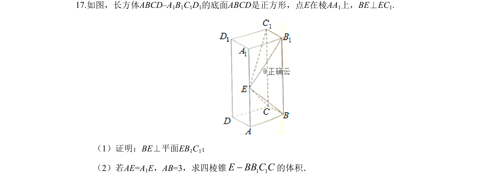
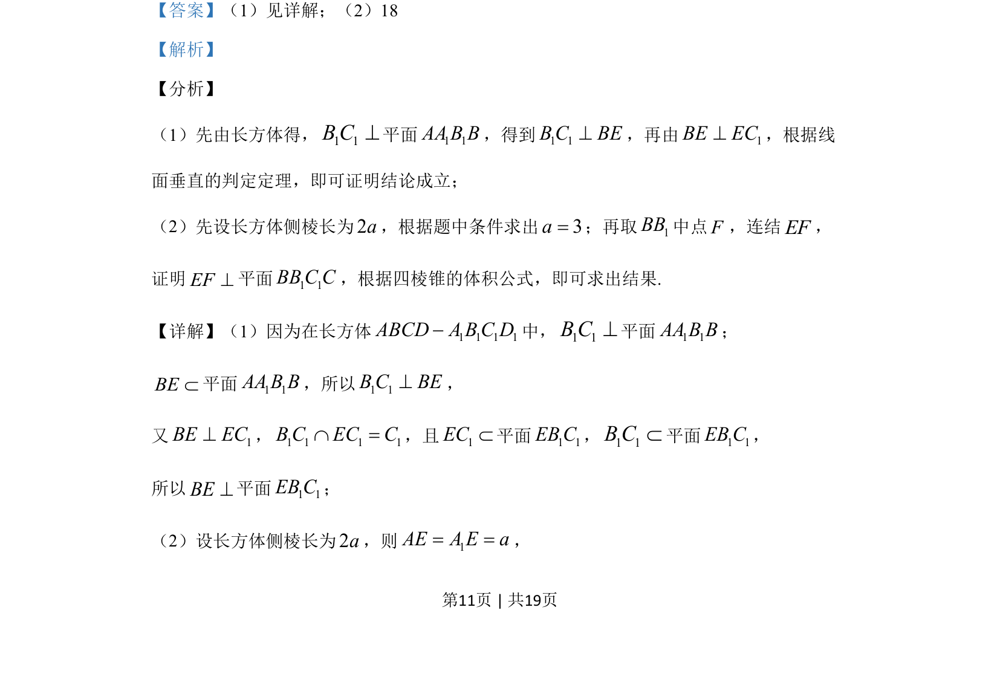
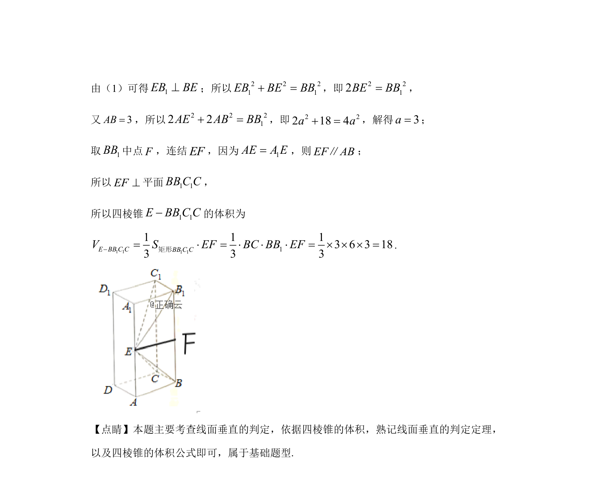

## 题面

## 摘要

考查长方体中线面垂直的证明及四棱锥体积计算

## 关联考点

- [[1088-线面垂直的判定定理|线面垂直的判定定理]]
- [[066-体积|四棱锥体积]]
- [[1046-空间几何体|空间几何体]]

## 答案与解析

> 📄 原 PDF 第 11 页：`素材/真题/吉林/2008-2024·（吉林）数学高考真题/2019年高考数学试卷（文）（新课标Ⅱ）（解析卷）.pdf`
