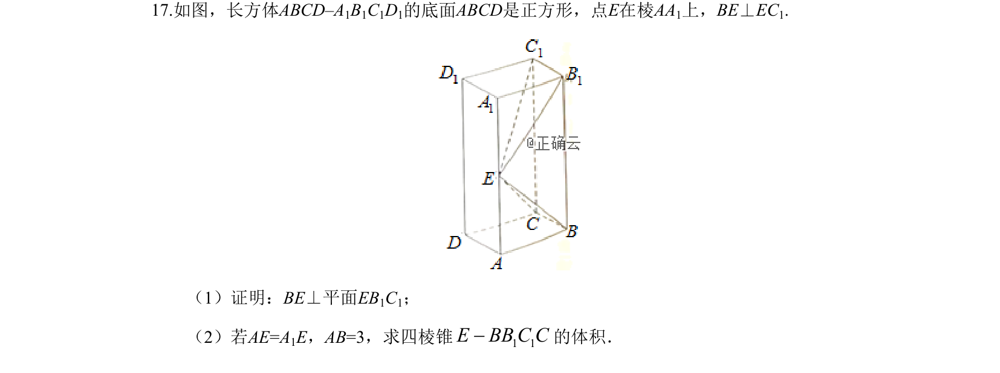
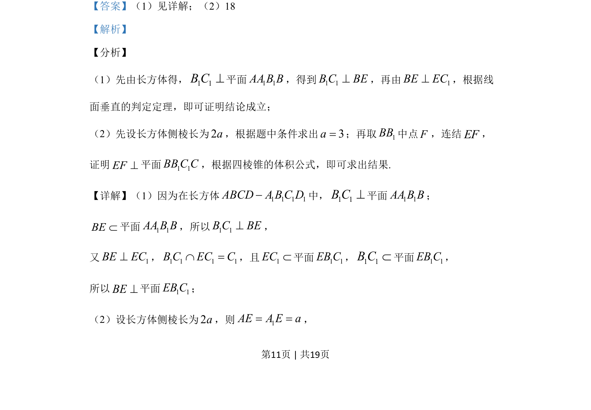
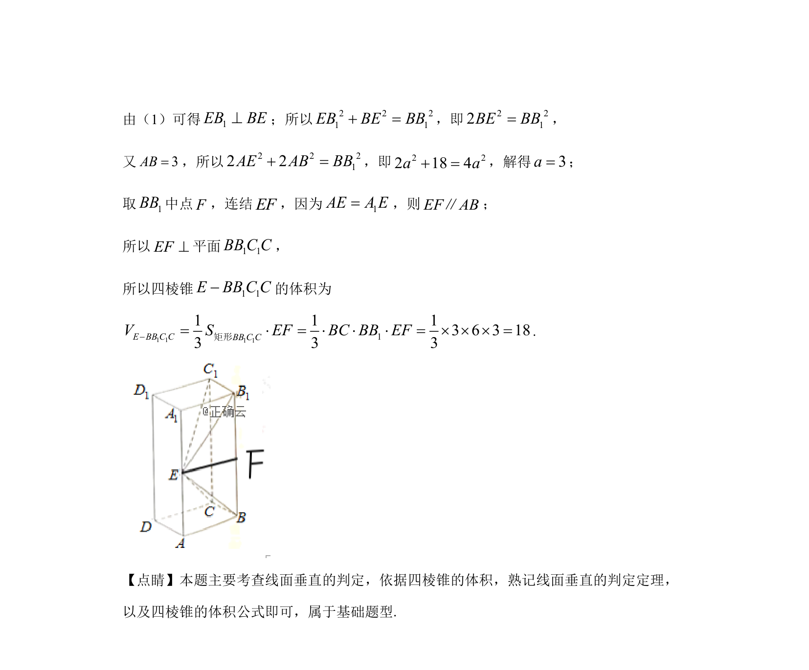

## 题面

## 摘要

考查长方体中线面垂直的证明及四棱锥体积计算

## 关联考点

- [[1087-线面垂直的判定定理|线面垂直的判定定理]]
- [[066-体积|四棱锥体积]]
- [[1045-空间几何体|空间几何体]]

## 答案与解析

> 📄 原 PDF 第 11 页：`素材/真题/吉林/2008-2024·（吉林）数学高考真题/2019年高考数学试卷（文）（新课标Ⅱ）（解析卷）.pdf`

<!-- 题干文本-start -->
## 题干文本
17.如图，长方体ABCD–A1B1C1D1的底面ABCD是正方形，点E在棱AA1上，BE⊥EC1.
（1）证明：BE⊥平面EB1C1；
（2）若AE=A1E，AB=3，求四棱锥 1 1E BB C C-的体积．
<!-- 题干文本-end -->

<!-- 解析文本-start -->
## 解析文本
【答案】（1）见详解；（2）18
【解析】
【分析】
（1）先由长方体得，1 1B C^平面1 1AA B B，得到1 1B C BE^，再由 1BE EC^，根据线
面垂直的判定定理，即可证明结论成立；
（2）先设长方体侧棱长为2a，根据题中条件求出3a=；再取1BB中点F，连结EF，
证明EF^平面1 1BB C C，根据四棱锥的体积公式，即可求出结果.
【详解】（1）因为在长方体 1 1 1 1ABCD A B C D-中，1 1B C^平面1 1AA B B；
BEÌ平面1 1AA B B，所以1 1B C BE^，
又 1BE EC^，1 1 1 1B C EC CÇ =，且1ECÌ平面1 1EB C，1 1B CÌ平面1 1EB C，
所以BE^平面1 1EB C；    
（2）设长方体侧棱长为2a，则 1AE A E a= =，
<!-- 解析文本-end -->
