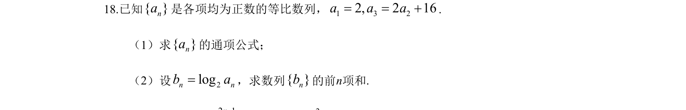
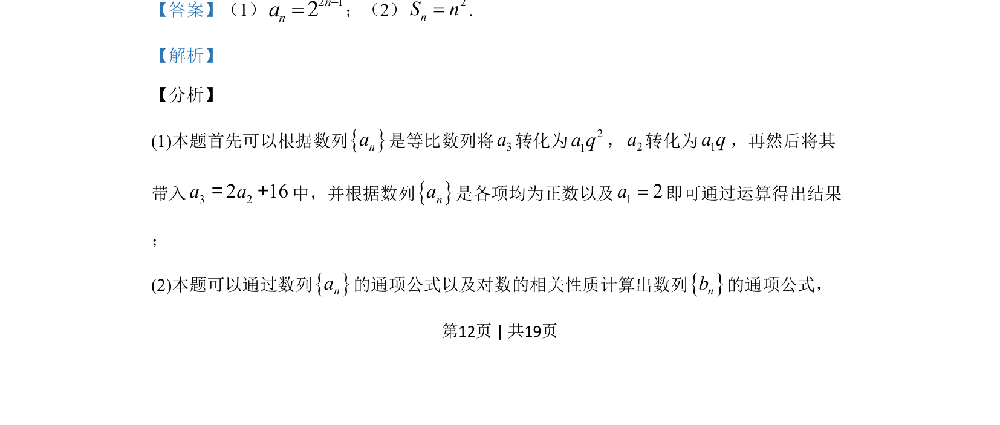
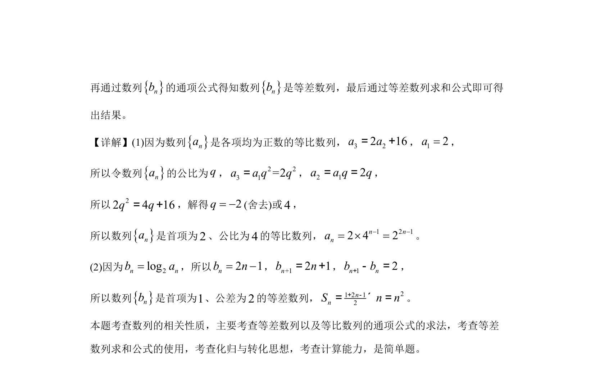

## 题面

## 摘要

等比数列的通项公式求解及对数运算后的等差数列求和。

## 关联考点

- [[358-等比数列概念|等比数列]]
- [[832-对数运算|对数的运算]]
- [[355-等差数列前n项和|等差数列求和]]

## 答案与解析

> 📄 原 PDF 第 12 页：`素材/真题/吉林/2008-2024·（吉林）数学高考真题/2019年高考数学试卷（文）（新课标Ⅱ）（解析卷）.pdf`

<!-- 题干文本-start -->
## 题干文本
18.已知{ }na是各项均为正数的等比数列，1 3 22, 2 16a a a= = +.
（1）求{ }na的通项公式；
（2）设 2logn nb a=，求数列{ }nb的前n项和.
<!-- 题干文本-end -->

<!-- 解析文本-start -->
## 解析文本
【答案】（1）2 12nna-=；（2） 2nS n=.
【解析】
【分析】
(1)本题首先可以根据数列na是等比数列将3a转化为21a q，2a转化为1a q，再然后将其
带入3 22 16a a= +中，并根据数列na是各项均为正数以及12a=即可通过运算得出结果
；
(2)本题可以通过数列na的通项公式以及对数的相关性质计算出数列nb的通项公式，
<!-- 解析文本-end -->
