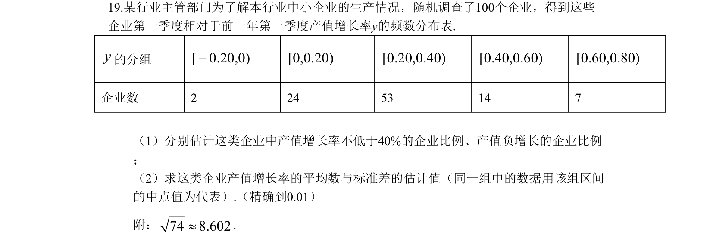
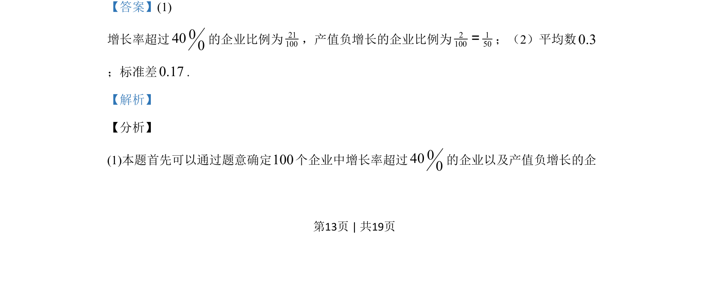
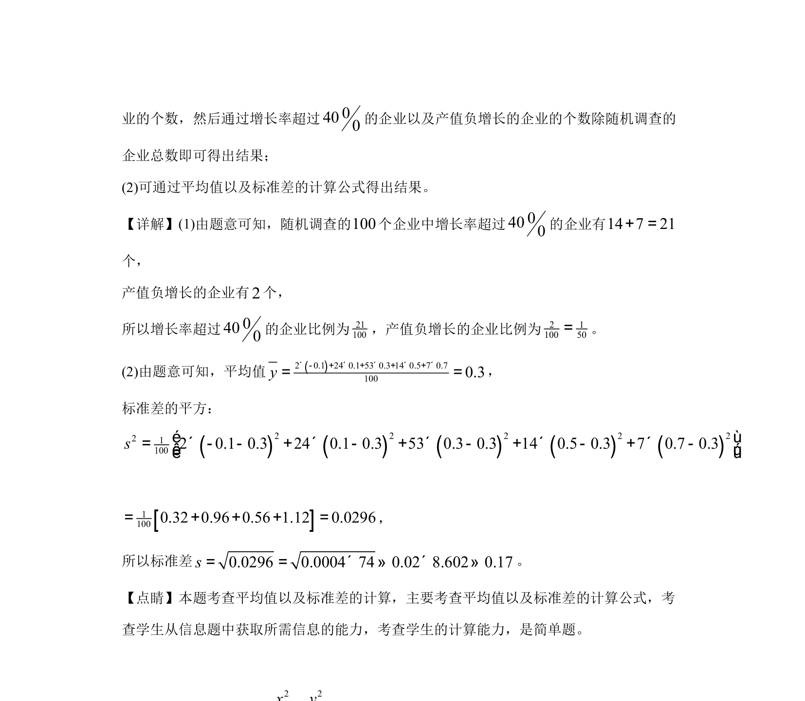

## 题面

## 摘要

本题通过频数分布表估计企业产值增长率的比例、平均数与标准差。

## 关联考点

- [[1153-频数分布表|频数分布表]]
- [[930-样本估计总体|样本估计总体]]
- [[055-平均数|平均数]]
- [[199-标准差|标准差]]

## 答案与解析

> 📄 原 PDF 第 13 页：`素材/真题/吉林/2008-2024·（吉林）数学高考真题/2019年高考数学试卷（文）（新课标Ⅱ）（解析卷）.pdf`
