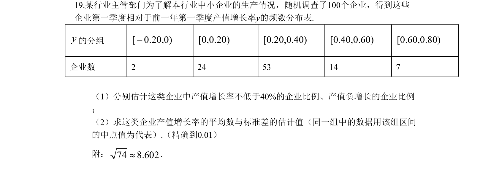
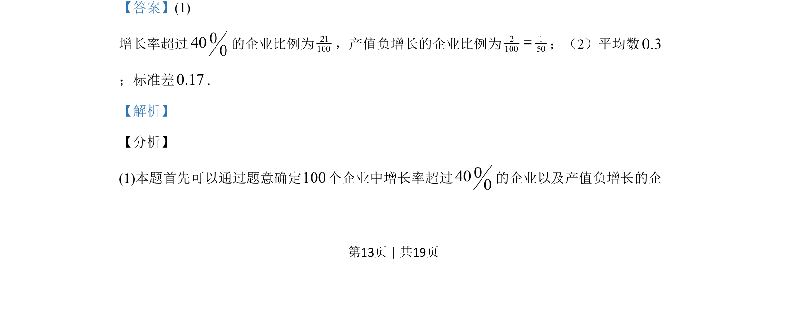
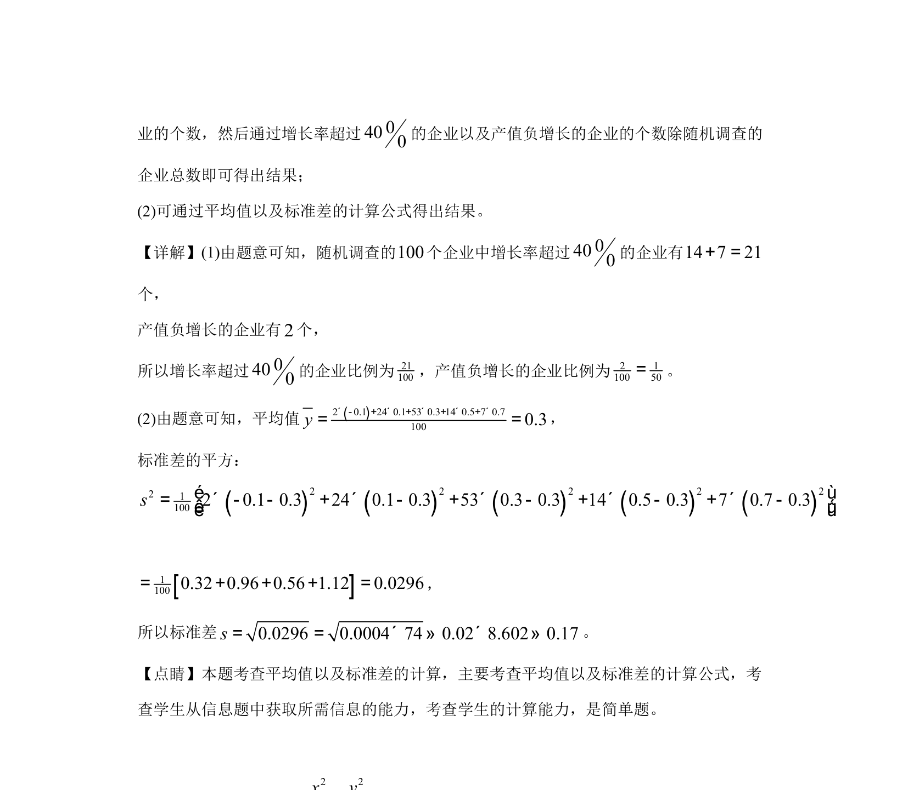

## 题面

## 摘要

本题通过频数分布表估计企业产值增长率的比例、平均数与标准差。

## 关联考点

- [[1152-频数分布表|频数分布表]]
- [[929-样本估计总体|样本估计总体]]
- [[055-平均数|平均数]]
- [[199-标准差|标准差]]

## 答案与解析

> 📄 原 PDF 第 13 页：`素材/真题/吉林/2008-2024·（吉林）数学高考真题/2019年高考数学试卷（文）（新课标Ⅱ）（解析卷）.pdf`

<!-- 题干文本-start -->
## 题干文本
19.某行业主管部门为了解本行业中小企业的生产情况，随机调查了100个企业，得到这些
企业第一季度相对于前一年第一季度产值增长率y的频数分布表.
y的分组[ 0.20,0)-[0,0.20)[0.20,0.40)[0.40,0.60)[0.60,0.80)
企业数 2 24 53 14 7
（1）分别估计这类企业中产值增长率不低于40%的企业比例、产值负增长的企业比例
；
（2）求这类企业产值增长率的平均数与标准差的估计值（同一组中的数据用该组区间
的中点值为代表）.（精确到0.01）
附：74 8.602».
<!-- 题干文本-end -->

<!-- 解析文本-start -->
## 解析文本
【答案】(1) 
增长率超过0400的企业比例为21100，产值负增长的企业比例为2 1100 50=；（2）平均数0.3
；标准差0.17.
【解析】
【分析】
(1)本题首先可以通过题意确定100个企业中增长率超过0400的企业以及产值负增长的企
<!-- 解析文本-end -->
