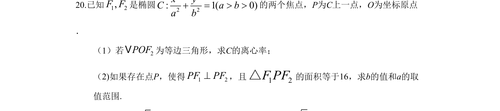
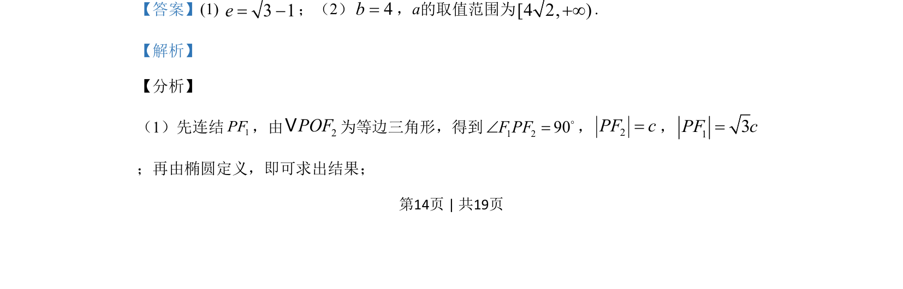
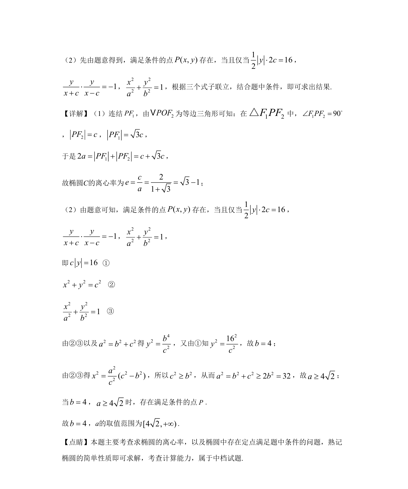

## 题面

## 摘要

本题通过等边三角形和垂直焦点三角形情境，考查椭圆定义、离心率及参数范围的求解。

## 关联考点

- [[1217-椭圆定义|椭圆定义]]
- [[391-椭圆离心率|离心率]]
- [[571-焦点三角形|焦点三角形]]
- [[791-垂直条件|垂直条件]]

## 答案与解析

> 📄 原 PDF 第 14 页：`素材/真题/吉林/2008-2024·（吉林）数学高考真题/2019年高考数学试卷（文）（新课标Ⅱ）（解析卷）.pdf`
