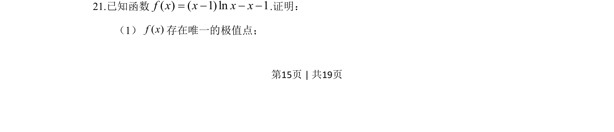
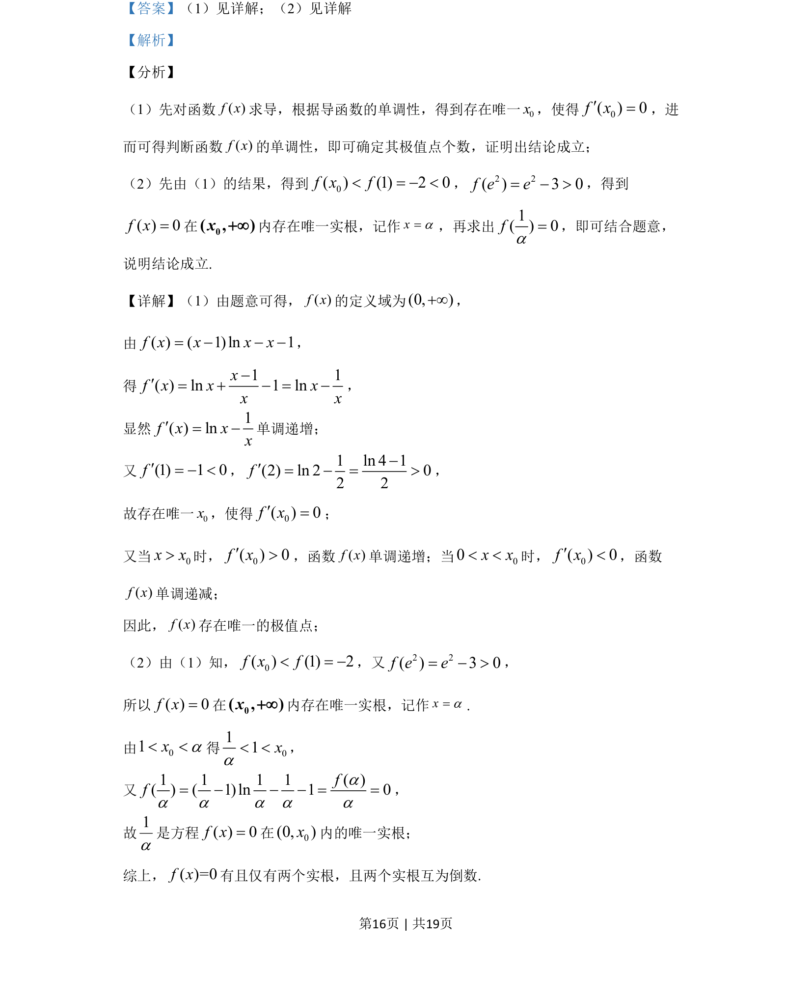
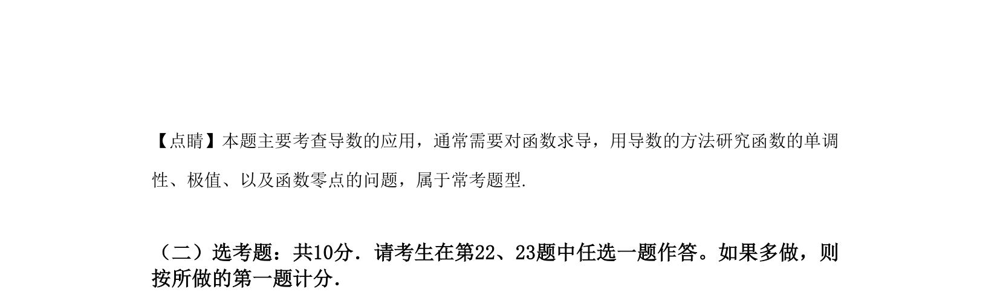

## 题面

## 摘要

证明含参函数的唯一极值点存在性。

## 关联考点

- [[436-导数应用-几何最值|导数应用]]
- [[函数极值]]
- [[零点存在定理]]
- [[432-导数与函数单调性|函数单调性]]

## 答案与解析

> 📄 原 PDF 第 15 页：`素材/真题/吉林/2008-2024·（吉林）数学高考真题/2019年高考数学试卷（文）（新课标Ⅱ）（解析卷）.pdf`
