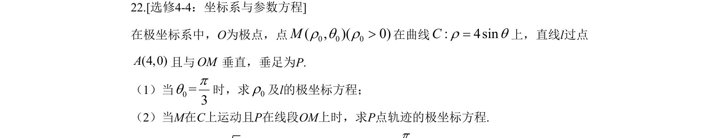
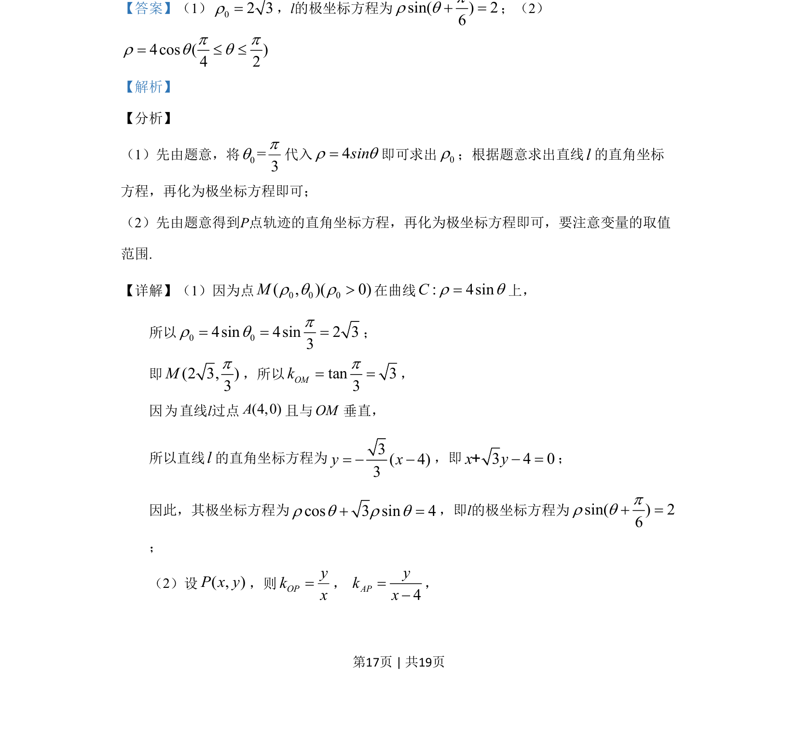
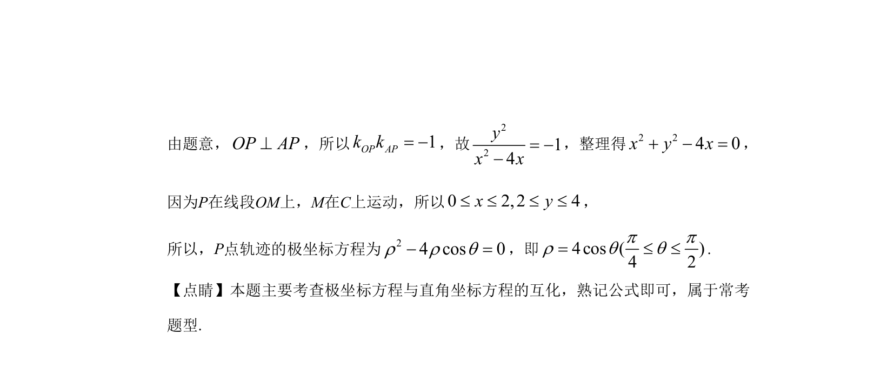

## 题面

## 摘要

在极坐标系中求极径、垂直直线的极坐标方程及动点轨迹的极坐标方程。

## 关联考点

- [[922-极坐标方程|极坐标方程]]
- [[1032-直角坐标与极坐标互化|直角坐标与极坐标互化]]
- [[376-圆锥曲线轨迹问题|轨迹方程]]
- [[1023-直线垂直|直线垂直]]

## 答案与解析

> 📄 原 PDF 第 17 页：`素材/真题/吉林/2008-2024·（吉林）数学高考真题/2019年高考数学试卷（文）（新课标Ⅱ）（解析卷）.pdf`
