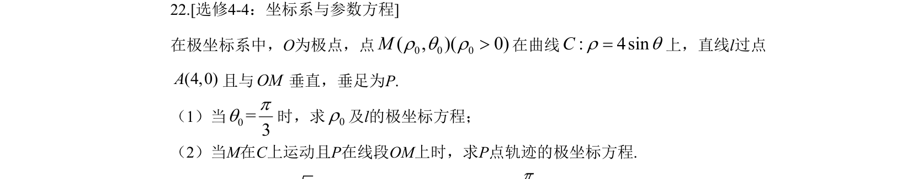
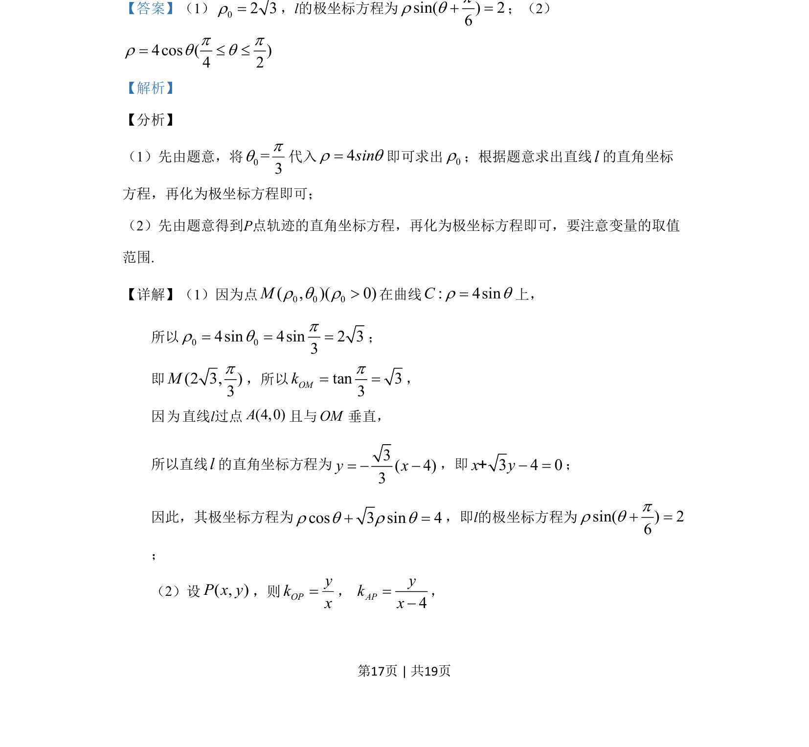
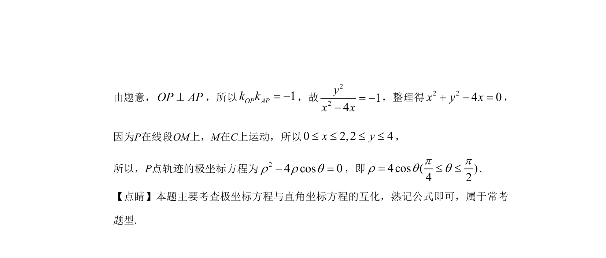

## 题面

## 摘要

在极坐标系中求极径、垂直直线的极坐标方程及动点轨迹的极坐标方程。

## 关联考点

- [[921-极坐标方程|极坐标方程]]
- [[1031-直角坐标与极坐标互化|直角坐标与极坐标互化]]
- [[376-圆锥曲线轨迹问题|轨迹方程]]
- [[1022-直线垂直|直线垂直]]

## 答案与解析

> 📄 原 PDF 第 17 页：`素材/真题/吉林/2008-2024·（吉林）数学高考真题/2019年高考数学试卷（文）（新课标Ⅱ）（解析卷）.pdf`

<!-- 题干文本-start -->
## 题干文本
22.[选修4-4：坐标系与参数方程] 
在极坐标系中，O为极点，点0 0 0( , )( 0)Mr q r>在曲线: 4sinCr q=上，直线l过点
(4,0)A且与OM垂直，垂足为P.
（1）当0=3pq时，求0r及l的极坐标方程；
（2）当M在C上运动且P在线段OM上时，求P点轨迹的极坐标方程.
<!-- 题干文本-end -->

<!-- 解析文本-start -->
## 解析文本
【答案】（1）02 3r=，l的极坐标方程为sin( ) 26pr q+ =；（2）
4cos ( )4 2p pr q q= £ £
【解析】
【分析】
（1）先由题意，将0=3pq代入4sinr q=即可求出0r；根据题意求出直线l的直角坐标
方程，再化为极坐标方程即可；
（2）先由题意得到P点轨迹的直角坐标方程，再化为极坐标方程即可，要注意变量的取值
范围.
【详解】（1）因为点0 0 0( , )( 0)Mr q r>在曲线: 4sinCr q=上，
所以0 04sin 4sin 2 33pr q= = =；
即(2 3, )3Mp，所以tan 33OMkp= =，
因 直线 l过点(4,0)A且与OM垂直，
所以直线l的直角坐标方程为3( 4)3y x= - -，即3 4 0x y- =+；
因此，其极坐标方程为cos3sin4rqrq+=，即l的极坐标方程为sin( ) 26pr q+ =
；
（2）设( , )P x y，则OPykx=， 
4APykx=-
，
为
<!-- 解析文本-end -->
