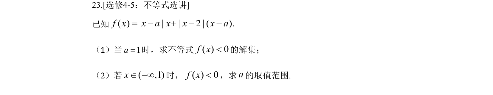
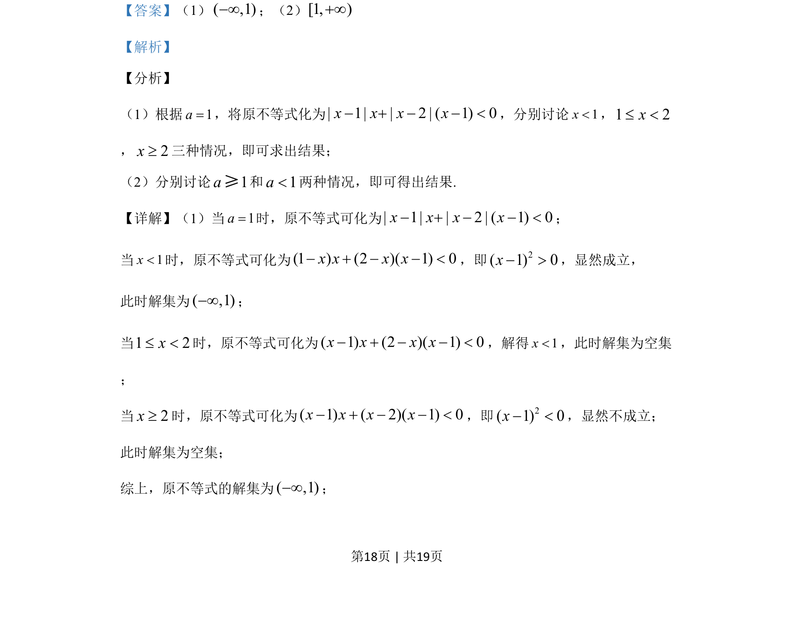
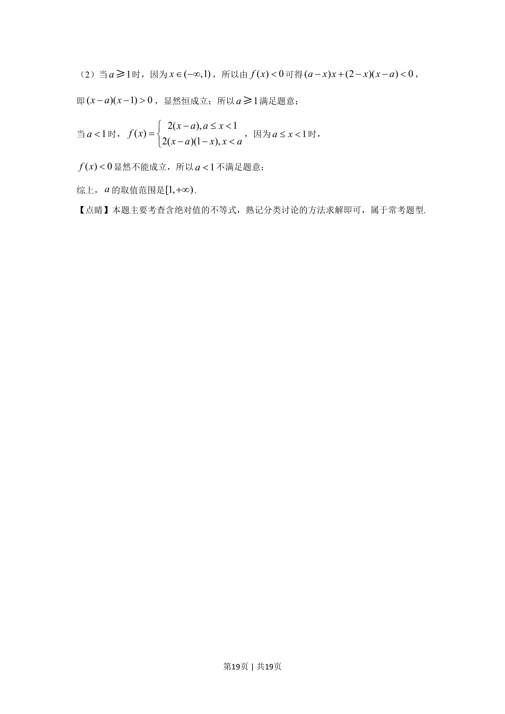

## 题面

## 摘要

含参绝对值不等式求解与恒成立问题，涉及分类讨论与参数范围确定。

## 关联考点

- [[绝对值不等式]]
- [[424-参数分类讨论|分类讨论]]
- [[450-恒成立问题|恒成立问题]]

## 答案与解析

> 📄 原 PDF 第 18 页：`素材/真题/吉林/2008-2024·（吉林）数学高考真题/2019年高考数学试卷（文）（新课标Ⅱ）（解析卷）.pdf`
