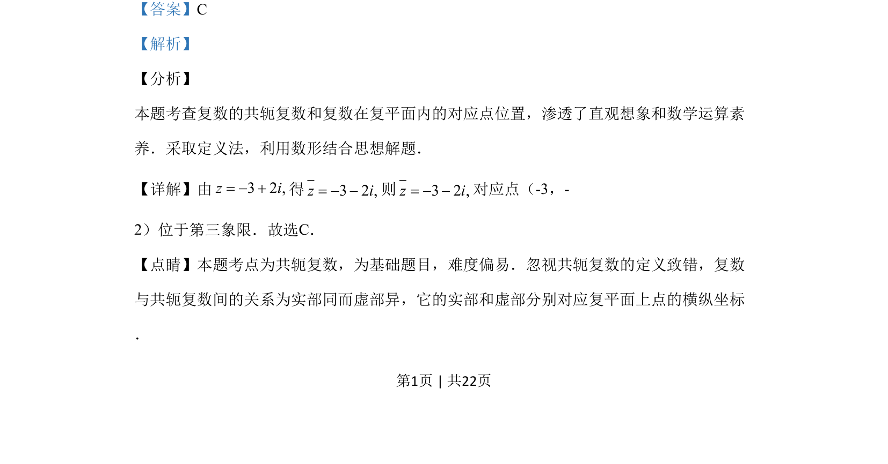

## 题面

## 摘要

本题考查复数的共轭复数概念及复数在复平面的对应点位置判断。

## 关联考点

- [[534-共轭复数|共轭复数]]
- [[333-复数的几何意义|复数的几何意义]]

## 答案与解析

> 📄 原 PDF 第 1 页：`素材/真题/吉林/2008-2024·（吉林）数学高考真题/2019年高考数学试卷（理）（新课标Ⅱ）（解析卷）.pdf`

<!-- 题干文本-start -->
## 题干文本
2.设z=-3+2i，则在复平面内z对应的点位于
A. 第一象限 B. 第二象限
C. 第三象限 D. 第四象限
<!-- 题干文本-end -->

<!-- 解析文本-start -->
## 解析文本
【答案】C
【解析】
【分析】
本题考查复数的共轭复数和复数在复平面内的对应点位置，渗透了直观想象和数学运算素
养．采取定义法，利用数形结合思想解题．
【详解】由32,zi=得32,zi=则32,zi=对应点（-3，-
2）位于第三象限．故选C．
【点睛】本题考点为共轭复数，为基础题目，难度偏易．忽视共轭复数的定义致错，复数
与共轭复数间的关系为实部同而虚部异，它的实部和虚部分别对应复平面上点的横纵坐标
．
<!-- 解析文本-end -->
