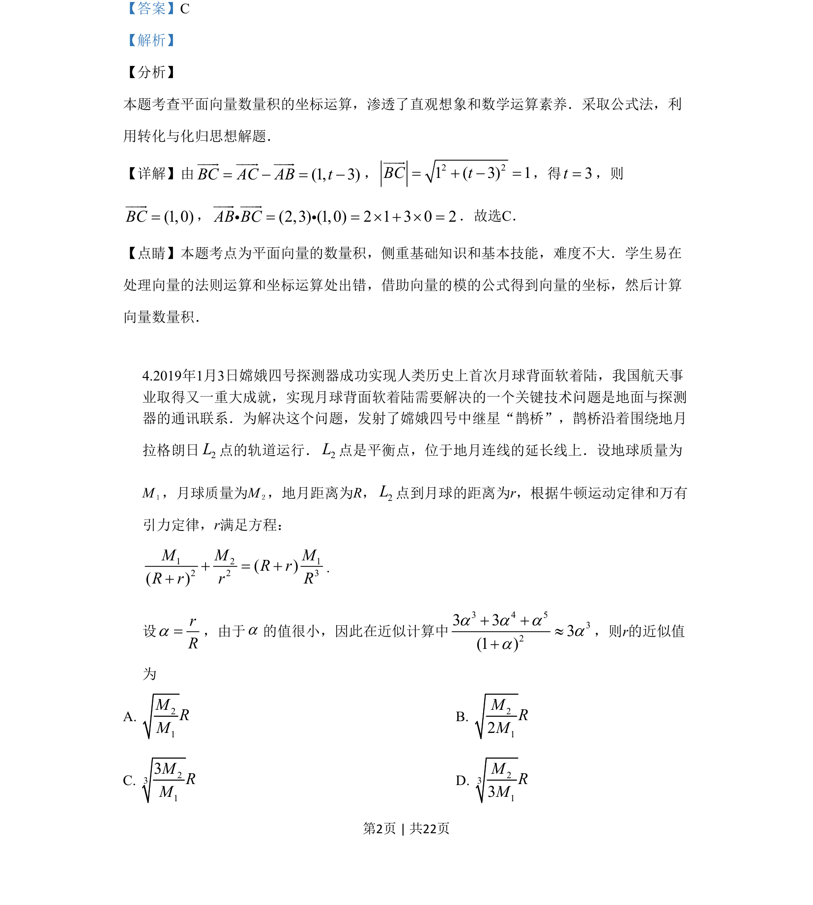

## 题面

## 摘要

本题考查平面向量数量积的坐标运算，利用向量的模求坐标再计算数量积。

## 关联考点

- [[854-平面向量数量积|平面向量数量积]]
- [[788-坐标运算|坐标运算]]
- [[752-向量模长|向量的模]]

## 答案与解析

> 📄 原 PDF 第 2 页：`素材/真题/吉林/2008-2024·（吉林）数学高考真题/2019年高考数学试卷（理）（新课标Ⅱ）（解析卷）.pdf`
