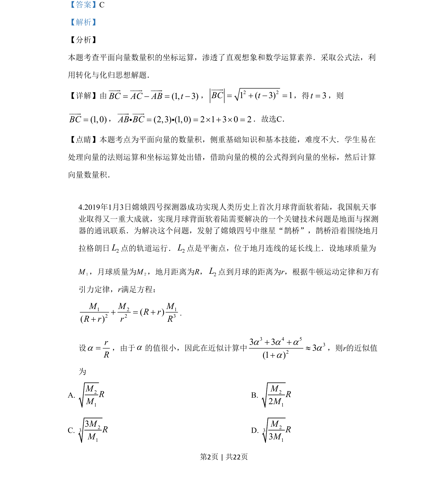

## 题面

## 摘要

本题考查平面向量数量积的坐标运算，利用向量的模求坐标再计算数量积。

## 关联考点

- [[854-平面向量数量积|平面向量数量积]]
- [[788-坐标运算|坐标运算]]
- [[752-向量模长|向量的模]]

## 答案与解析

> 📄 原 PDF 第 2 页：`素材/真题/吉林/2008-2024·（吉林）数学高考真题/2019年高考数学试卷（理）（新课标Ⅱ）（解析卷）.pdf`

<!-- 题干文本-start -->
## 题干文本
3.已知ABuuu v=(2,3)，ACuuu v
=(3，t)，BCuuu r
=1，则AB BC×uuu r uuu r
=
A. -3 B. -2
C. 2 D. 3
<!-- 题干文本-end -->

<!-- 解析文本-start -->
## 解析文本
【答案】C
【解析】
【分析】
本题考查平面向量数量积的坐标运算，渗透了直观想象和数学运算素养．采取公式法，利
用转化与化归思想解题．
【详解】由 (1,3)BCACABt==uuuruuuruuur
， 221(3)1BCt==uuur
，得3t=，则
(1,0)BC=uuu r
， (2,3)(1,0)21302ABBC===uuuruuur．故选C．
【点睛】本题考点为平面向量的数量积，侧重基础知识和基本技能，难度不大．学生易在
处理向量的法则运算和坐标运算处出错，借助向量的模的公式得到向量的坐标，然后计算
向量数量积．
<!-- 解析文本-end -->
