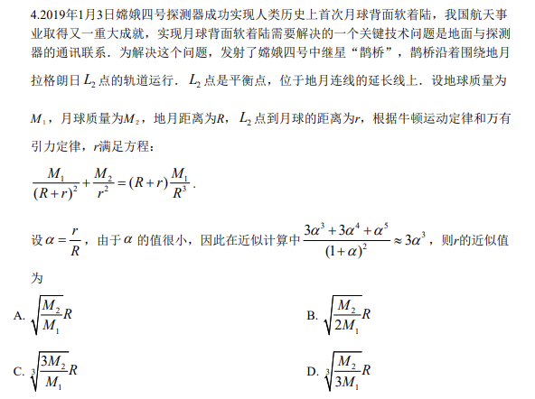
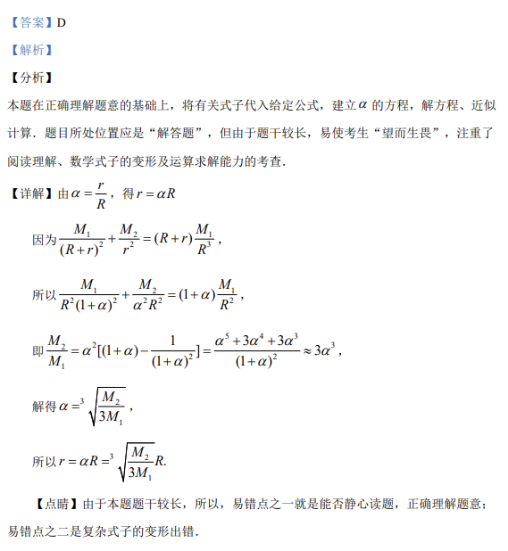

## 题面

## 摘要

嫦娥四号在月球 L2 点轨道运行，由万有引力定律和牛顿运动定律推导，求 L2 点到月球距离 r 的近似值。

## 关联考点

- [[246-万有引力定律|万有引力定律]]
- [[牛顿运动定律]]
- [[近似计算]]
- [[数学建模]]
- [[实际应用]]

## 答案与解析

> 📄 原 PDF 第 2 页：`素材/真题/吉林/2008-2024·（吉林）数学高考真题/2019年高考数学试卷（理）（新课标Ⅱ）（解析卷）.pdf`
