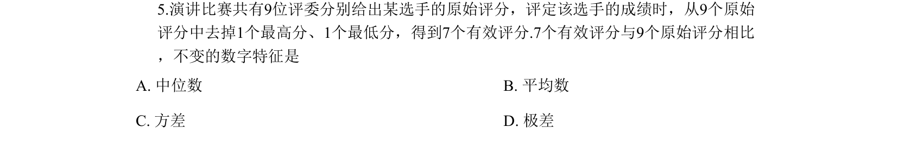
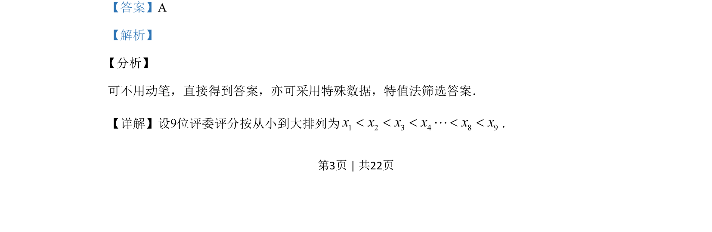

## 题面

## 摘要

该题通过评委评分去掉最高最低后的统计量变化，考查中位数、平均数、方差、极差的性质。

## 关联考点

- [[180-中位数|中位数]]
- [[055-平均数|平均数]]
- [[198-方差|方差]]
- [[922-极差|极差]]

## 答案与解析

> 📄 原 PDF 第 3 页：`素材/真题/吉林/2008-2024·（吉林）数学高考真题/2019年高考数学试卷（理）（新课标Ⅱ）（解析卷）.pdf`
