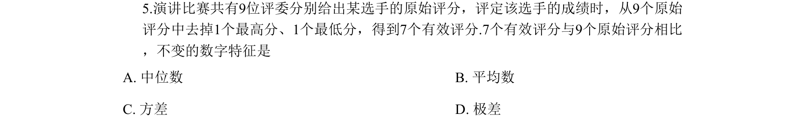
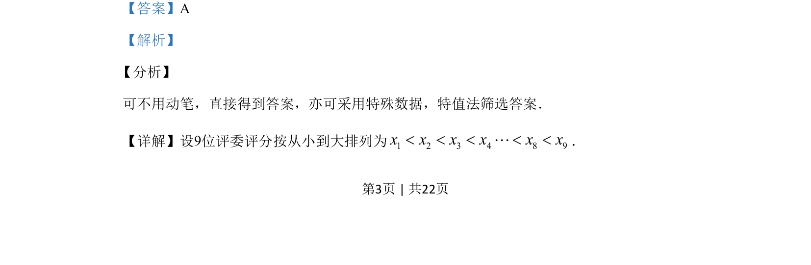

## 题面

## 摘要

该题通过评委评分去掉最高最低后的统计量变化，考查中位数、平均数、方差、极差的性质。

## 关联考点

- [[180-中位数|中位数]]
- [[055-平均数|平均数]]
- [[198-方差|方差]]
- [[922-极差|极差]]

## 答案与解析

> 📄 原 PDF 第 3 页：`素材/真题/吉林/2008-2024·（吉林）数学高考真题/2019年高考数学试卷（理）（新课标Ⅱ）（解析卷）.pdf`

<!-- 题干文本-start -->
## 题干文本
5.演讲比赛共有9位评委分别给出某选手的原始评分，评定该选手的成绩时，从9个原始
评分中去掉1个最高分、1个最低分，得到7个有效评分.7个有效评分与9个原始评分相比
，不变的数字特征是
A. 中位数 B. 平均数
C. 方差 D. 极差
<!-- 题干文本-end -->

<!-- 解析文本-start -->
## 解析文本
【答案】A
【解析】
分析】
可不用动笔，直接得到答案，亦可采用特殊数据，特值法筛选答案．
【详解】设9位评委评分按从小到大排列为1 2 3 4 8 9x x x x x x< < < < <L．
【
<!-- 解析文本-end -->
