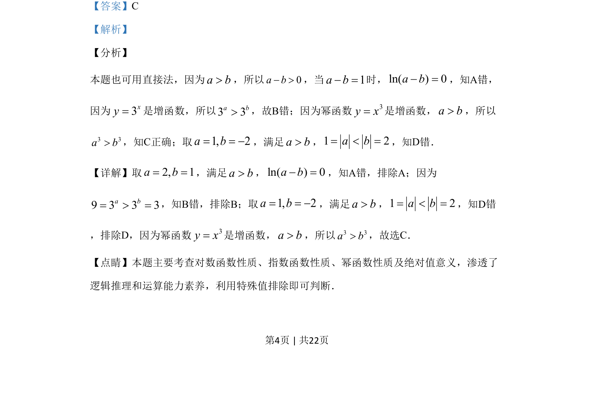

## 题面

## 摘要

本题通过特值法结合函数单调性判断不等式正误，考查对数、指数、幂函数性质及绝对值意义。

## 关联考点

- [[298-对数函数|对数函数性质]]
- [[883-指数函数性质|指数函数性质]]
- [[842-幂函数性质|幂函数性质]]
- [[981-特值排除法|特值排除法]]

## 答案与解析

> 📄 原 PDF 第 4 页：`素材/真题/吉林/2008-2024·（吉林）数学高考真题/2019年高考数学试卷（理）（新课标Ⅱ）（解析卷）.pdf`
