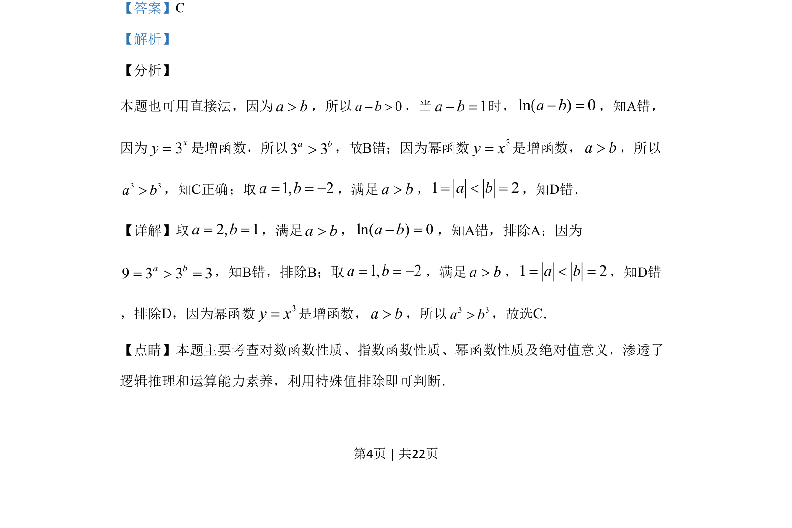

## 题面

## 摘要

本题通过特值法结合函数单调性判断不等式正误，考查对数、指数、幂函数性质及绝对值意义。

## 关联考点

- [[298-对数函数|对数函数性质]]
- [[306-指数函数的性质|指数函数性质]]
- [[842-幂函数性质|幂函数性质]]
- [[981-特值排除法|特值排除法]]

## 答案与解析

> 📄 原 PDF 第 4 页：`素材/真题/吉林/2008-2024·（吉林）数学高考真题/2019年高考数学试卷（理）（新课标Ⅱ）（解析卷）.pdf`

<!-- 题干文本-start -->
## 题干文本
6.若a>b，则
A. ln(a−b)>0 B. 3 a<3b
C. a3−b3>0 D. │a│>│b│
<!-- 题干文本-end -->

<!-- 解析文本-start -->
## 解析文本
【答案】C
【解析】
【分析】
本题也可用直接法，因为a b>，所以0a b− >，当1a b− =时，ln( ) 0a b− =，知A错，
因为3xy=是增函数，所以3 3a b>，故B错；因为幂函数3y x=是增函数，a b>，所以
3 3a b>，知C正确；取1, 2a b= = −，满足a b>，1 2a b= < =，知D错．
【详解】取2, 1a b= =，满足a b>，ln( ) 0a b− =，知A错，排除A；因为
9 3 3 3a b= > =，知B错，排除B；取1, 2a b= = −，满足a b>，1 2a b= < =，知D错
，排除D，因为幂函数3y x=是增函数，a b>，所以3 3a b>，故选C．
【点睛】本题主要考查对数函数性质、指数函数性质、幂函数性质及绝对值意义，渗透了
逻辑推理和运算能力素养，利用特殊值排除即可判断．
<!-- 解析文本-end -->
