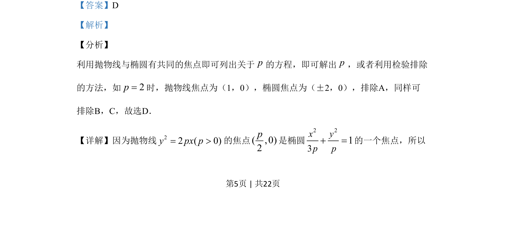

## 题面

## 摘要

本题通过抛物线与椭圆共焦点条件求参数p，考查标准方程与焦点坐标关系。

## 关联考点

- [[378-抛物线几何性质|抛物线的几何性质]]
- [[388-椭圆几何性质|椭圆的几何性质]]
- [[1217-焦点坐标|焦点坐标]]

## 答案与解析

> 📄 原 PDF 第 5 页：`素材/真题/吉林/2008-2024·（吉林）数学高考真题/2019年高考数学试卷（理）（新课标Ⅱ）（解析卷）.pdf`

<!-- 题干文本-start -->
## 题干文本
8.若抛物线y2=2px（p>0）的焦点是椭圆
2 231x yp p+ =的一个焦点，则p=
A. 2 B. 3
C. 4 D. 8
<!-- 题干文本-end -->

<!-- 解析文本-start -->
## 解析文本
【答案】D
【解析】
【分析】
利用抛物线与椭圆有共同的焦点即可列出关于p的方程，即可解出p，或者利用检验排除
的方法，如2p=时，抛物线焦点为（1，0），椭圆焦点为（±2，0），排除A，同样可
排除B，C，故选D．
【详解】因为抛物线22 ( 0)y px p= >的焦点( ,0)2p是椭圆
2 231x yp p+ =的一个焦点，所以
<!-- 解析文本-end -->
