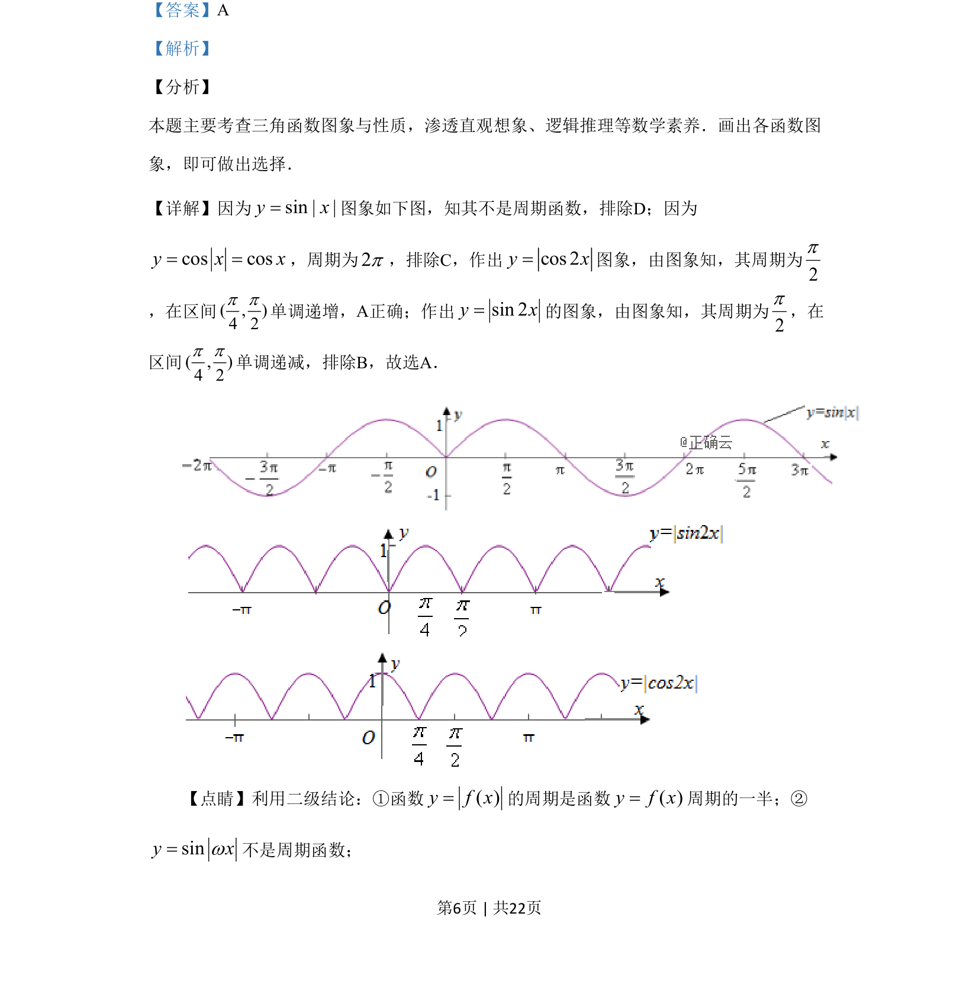

## 题面

## 摘要

本题考查三角函数的图象识别，通过分析正弦、余弦函数的周期性与单调性选择正确选项。

## 关联考点

- [[612-三角函数的图像与性质|三角函数的图象与性质]]
- [[761-周期性|周期性]]
- [[719-单调性|单调性]]

## 答案与解析

> 📄 原 PDF 第 6 页：`素材/真题/吉林/2008-2024·（吉林）数学高考真题/2019年高考数学试卷（理）（新课标Ⅱ）（解析卷）.pdf`

<!-- 题干文本-start -->
## 题干文本
9.下列函数中，以
2p为周期且在区间(
4p，
2p)单调递增的是
A. f(x)=│cos 2x│B. f(x)=│sin 2x│
C. f(x)=cos│x│D. f(x)= sin│x│
<!-- 题干文本-end -->

<!-- 解析文本-start -->
## 解析文本
【答案】A
【解析】
【分析】
本题主要考查三角函数图象与性质，渗透直观想象、逻辑推理等数学素养．画出各函数图
象，即可做出选择．
【详解】因为sin||yx=图象如下图，知其不是周期函数，排除D；因为
cos cosy x x= =，周期为2p，排除C，作出cos 2y x=图象，由图象知，其周期为
2p
，在区间( , )4 2p p单调递增，A正确；作出sin 2y x=的图象，由图象知，其周期为
2p，在
区间( , )4 2p p单调递减，排除B，故选A．
【点睛】利用二级结论：①函数( )y f x=的周期是函数( )y f x=周期的一半；②
siny xw=不是周期函数；
<!-- 解析文本-end -->
