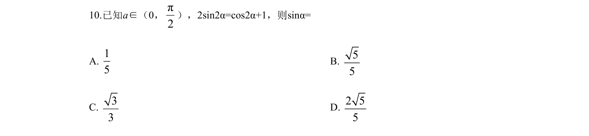
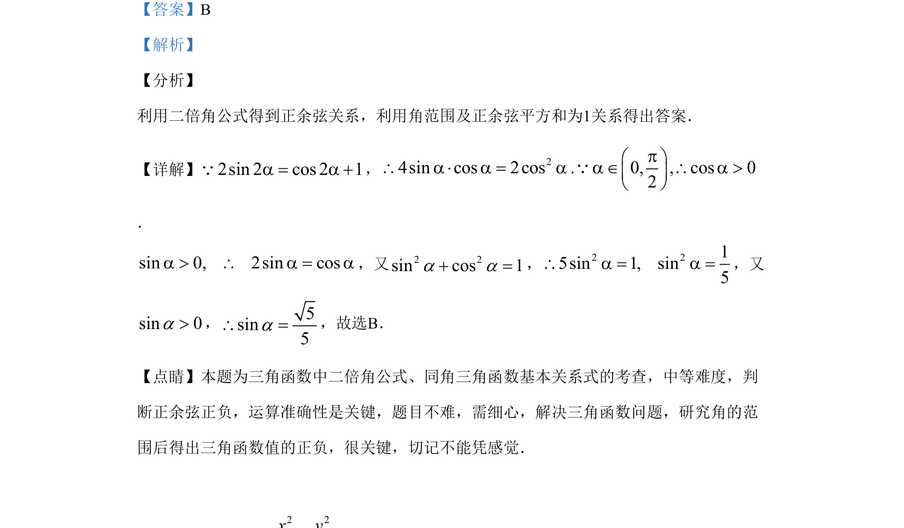

## 题面

## 摘要

利用二倍角公式和同角关系求正弦值，需注意角范围判断正负。

## 关联考点

- [[637-二倍角公式|二倍角公式]]
- [[540-同角三角函数基本关系式|同角三角函数基本关系式]]
- [[610-三角函数求值|三角函数求值]]

## 答案与解析

> 📄 原 PDF 第 7 页：`素材/真题/吉林/2008-2024·（吉林）数学高考真题/2019年高考数学试卷（理）（新课标Ⅱ）（解析卷）.pdf`

<!-- 题干文本-start -->
## 题干文本
10.已知a∈（0，π2
），2sin2α=cos2α+1，则sinα=
A. 15
B. 55
C. 33
D. 2 55
<!-- 题干文本-end -->

<!-- 解析文本-start -->
## 解析文本
【答案】B
【解析】
【分析】
利用二倍角公式得到正余弦关系，利用角范围及正余弦平方和为1关系得出答案．
【详解】2sin 2 cos 2 1a = a +Q， 24sin cos 2cos . 0, , cos 02pæ ö\ a × a = a a Î \ a >ç ÷è øQ
．
sin 0, 2sin cosa > \ a = a，又2 2sin cos 1a a+ =， 2 215sin 1, sin5\ a = a =，又
sin 0a>， 5sin5a\ =，故选B．
【点睛】本题为三角函数中二倍角公式、同角三角函数基本关系式的考查，中等难度，判
断正余弦正负，运算准确性是关键，题目不难，需细心，解决三角函数问题，研究角的范
围后得出三角函数值的正负，很关键，切记不能凭感觉．
<!-- 解析文本-end -->
