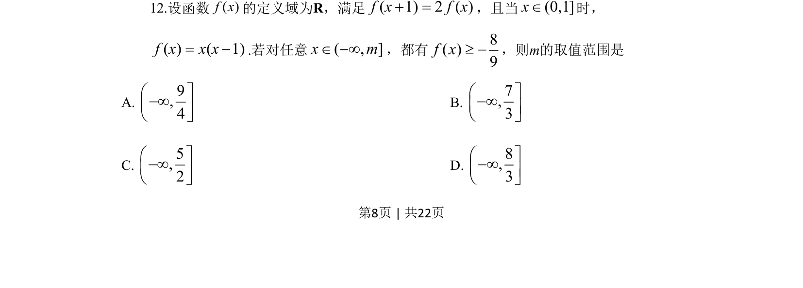
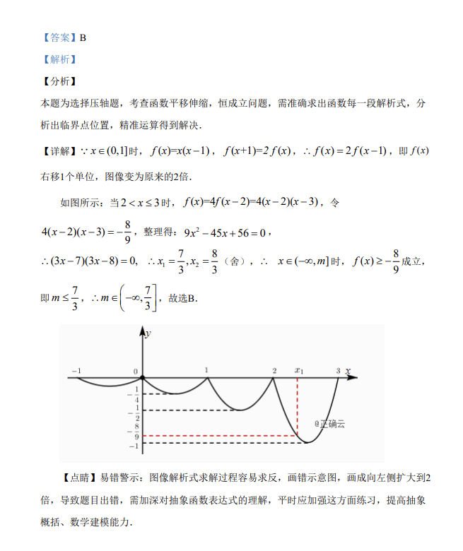

## 题面

## 摘要

函数f满足f(x+1)=2f(x)且x∈(0,1]时f(x)=x(x-1)，对任意x∈(-∞,m]均有f(x)≥-8/9，求m的取值范围。

## 关联考点

- [[抽象函数]]
- [[383-数列递推公式|递推关系]]
- [[286-函数的最值|最值]]
- [[450-恒成立问题|恒成立问题]]

## 答案与解析

> 📄 原 PDF 第 8 页：`素材/真题/吉林/2008-2024·（吉林）数学高考真题/2019年高考数学试卷（理）（新课标Ⅱ）（解析卷）.pdf`
