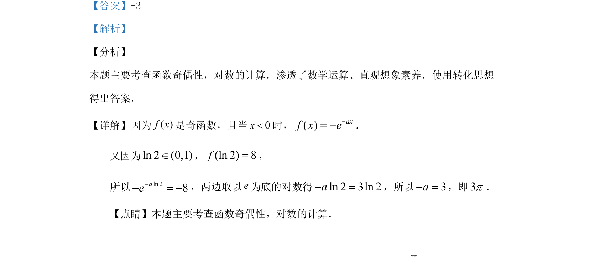

## 题面

## 摘要

考查函数奇偶性与对数运算，利用奇函数性质转化求参数值。

## 关联考点

- [[679-函数奇偶性|函数奇偶性]]
- [[833-对数运算|对数运算]]
- [[1126-转化思想|转化思想]]

## 答案与解析

> 📄 原 PDF 第 10 页：`素材/真题/吉林/2008-2024·（吉林）数学高考真题/2019年高考数学试卷（理）（新课标Ⅱ）（解析卷）.pdf`
