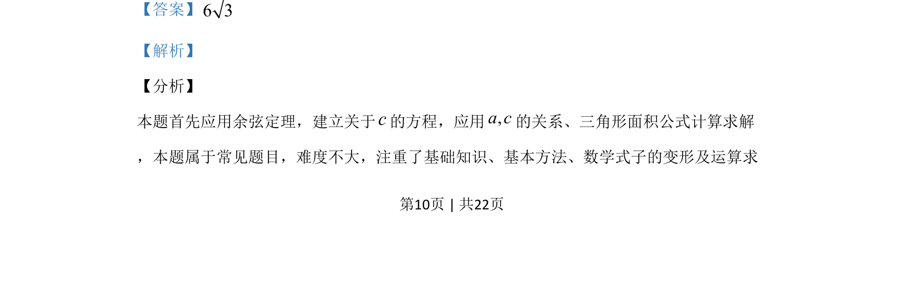

## 题面

## 摘要

应用余弦定理建立方程求边长，再利用三角形面积公式计算面积。

## 关联考点

- [[126-定理|余弦定理]]
- [[062-多边形面积|三角形面积]]
- [[589-解三角形|解三角形]]

## 答案与解析

> 📄 原 PDF 第 10 页：`素材/真题/吉林/2008-2024·（吉林）数学高考真题/2019年高考数学试卷（理）（新课标Ⅱ）（解析卷）.pdf`

<!-- 题干文本-start -->
## 题干文本
15.VABC的内角, ,A B C的对边分别为, ,a b c.若 π6, 2 ,3b a c B= = =，则VABC的面
积为__________.
<!-- 题干文本-end -->

<!-- 解析文本-start -->
## 解析文本
【答案】6 3
【解析】
【分析】
本题首先应用余弦定理，建立关于c的方程，应用,a c的关系、三角形面积公式计算求解
，本题属于常见题目，难度不大，注重了基础知识、基本方法、数学式子的变形及运算求
<!-- 解析文本-end -->
