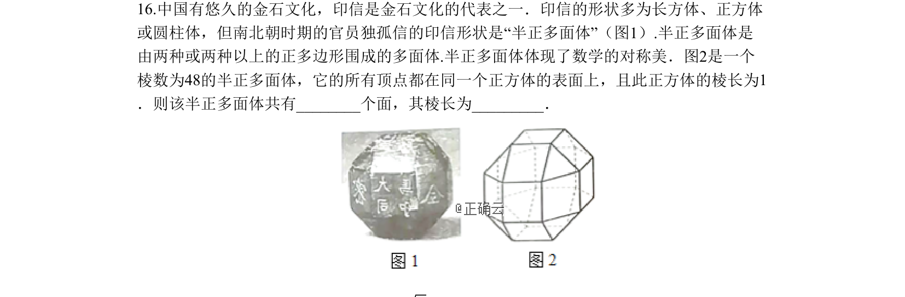
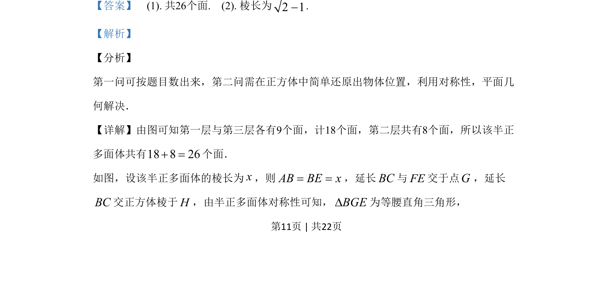

## 题面

## 摘要

棱数48的半正多面体各顶点在棱长为1的正方体表面上，求该多面体的面数（26）和棱长（√2-1）。

## 关联考点

- [[1055-立体几何|立体几何]]
- [[346-空间几何体-多面体|多面体]]

## 答案与解析

> 📄 原 PDF 第 11 页：`素材/真题/吉林/2008-2024·（吉林）数学高考真题/2019年高考数学试卷（理）（新课标Ⅱ）（解析卷）.pdf`
