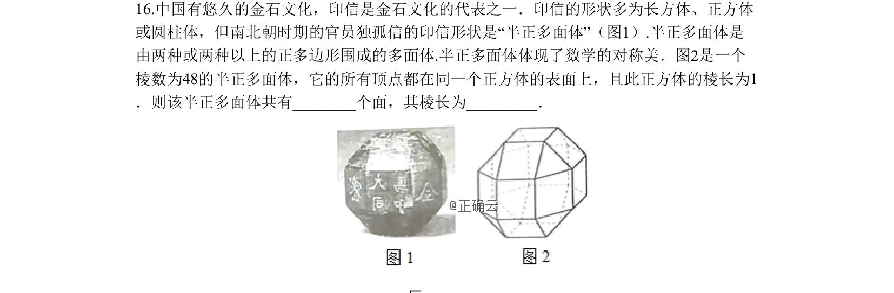
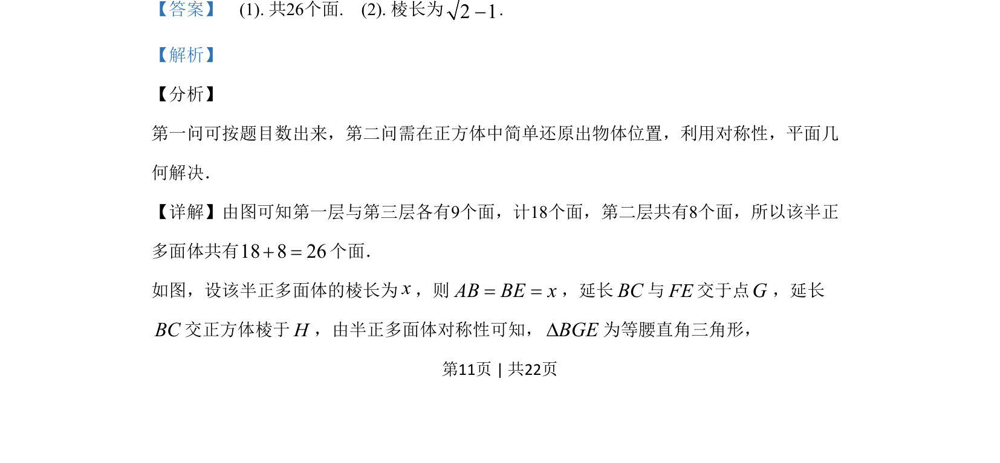

## 题面

## 摘要

棱数48的半正多面体各顶点在棱长为1的正方体表面上，求该多面体的面数（26）和棱长（√2-1）。

## 关联考点

- [[1055-立体几何|立体几何]]
- [[346-空间几何体-多面体|多面体]]

## 答案与解析

> 📄 原 PDF 第 11 页：`素材/真题/吉林/2008-2024·（吉林）数学高考真题/2019年高考数学试卷（理）（新课标Ⅱ）（解析卷）.pdf`

<!-- 题干文本-start -->
## 题干文本
16.中国有悠久的金石文化，印信是金石文化的代表之一．印信的形状多为长方体、正方体
或圆柱体，但南北朝时期的官员独孤信的印信形状是“半正多面体”（图1）.半正多面体是
由两种或两种以上的正多边形围成的多面体.半正多面体体现了数学的对称美．图2是一个
棱数为48的半正多面体，它的所有顶点都在同一个正方体的表面上，且此正方体的棱长为1
．则该半正多面体共有________个面，其棱长为_________．
<!-- 题干文本-end -->

<!-- 解析文本-start -->
## 解析文本
【答案】    (1). 共26个面.    (2). 棱长为2 1−.
【解析】
【分析】
第一问可按题目数出来，第二问需在正方体中简单还原出物体位置，利用对称性，平面几
何解决．
【详解】由图可知第一层与第三层各有9个面，计18个面，第二层共有8个面，所以该半正
多面体共有18 8 26+ =个面．
如图，设该半正多面体的棱长为x，则AB BE x= =，延长BC与FE交于点G，延长
BC交正方体棱于H，由半正多面体对称性可知，BGED为等腰直角三角形，
<!-- 解析文本-end -->
