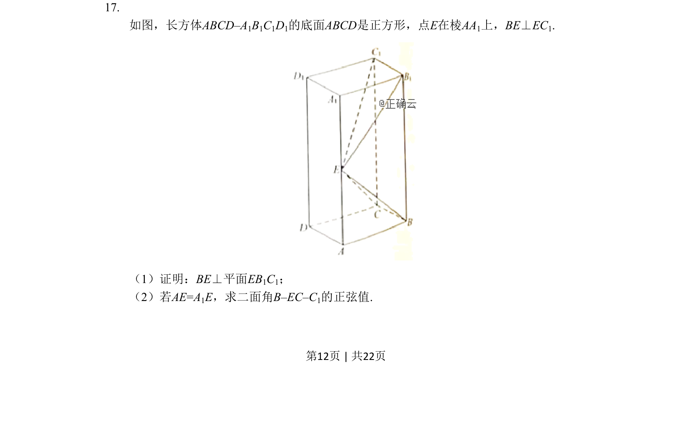
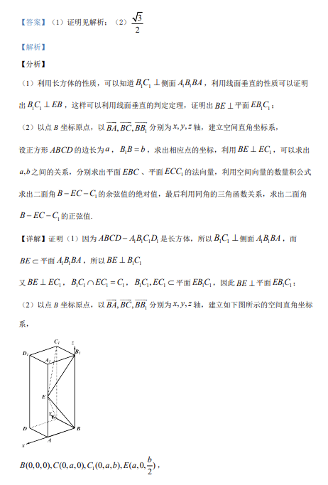

## 题面

## 摘要

长方体中E在棱AA₁上且BE⊥EC₁，证明BE⊥平面EB₁C₁，在AE=A₁E时求二面角B-EC-C₁的正弦值。

## 关联考点

- [[1056-立体几何|立体几何]]
- [[351-空间直线平面垂直|线面垂直]]
- [[353-空间角|二面角]]

## 答案与解析

> 📄 原 PDF 第 12 页：`素材/真题/吉林/2008-2024·（吉林）数学高考真题/2019年高考数学试卷（理）（新课标Ⅱ）（解析卷）.pdf`
