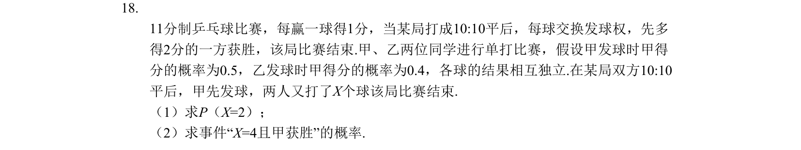
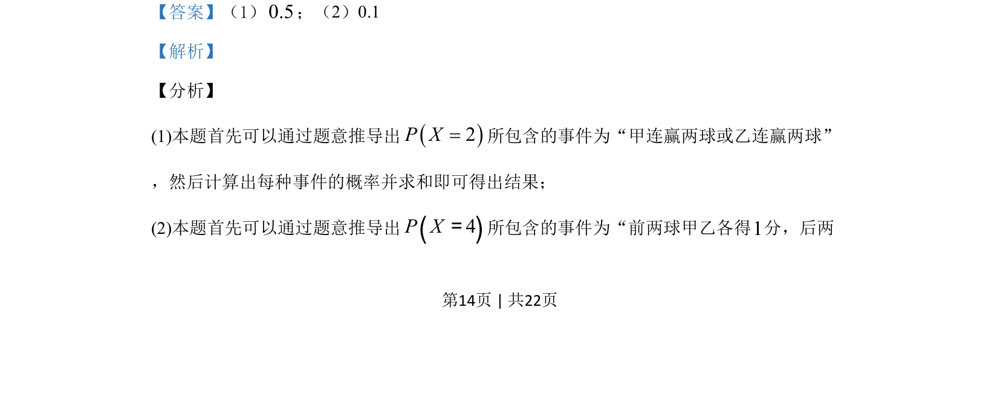

## 题面

## 摘要

11分制乒乓球10:10平局后概率问题，求P(X=2)及X=4且甲获胜的概率，各球结果相互独立。

## 关联考点

- [[945-概率|概率]]
- [[318-事件的独立性|独立重复试验]]

## 答案与解析

> 📄 原 PDF 第 14 页：`素材/真题/吉林/2008-2024·（吉林）数学高考真题/2019年高考数学试卷（理）（新课标Ⅱ）（解析卷）.pdf`

<!-- 题干文本-start -->
## 题干文本
18.
11分制乒乓球比赛，每赢一球得1分，当某局打成10:10平后，每球交换发球权，先多
得2分的一方获胜，该局比赛结束.甲、乙两位同学进行单打比赛，假设甲发球时甲得
分的概率为0.5，乙发球时甲得分的概率为0.4，各球的结果相互独立.在某局双方10:10
平后，甲先发球，两人又打了X个球该局比赛结束.
（1）求P（X=2）；
（2）求事件“X=4且甲获胜”的概率.
<!-- 题干文本-end -->

<!-- 解析文本-start -->
## 解析文本
【答案】（1）0.5；（2）0.1
【解析】
【分析】
(1)本题首先可以通过题意推导出()2P X=所包含的事件为“甲连赢两球或乙连赢两球”
，然后计算出每种事件的概率并求和即可得出结果；
(2)本题首先可以通过题意推导出()4P X=所包含的事件为“前两球甲乙各得1分，后两
<!-- 解析文本-end -->
