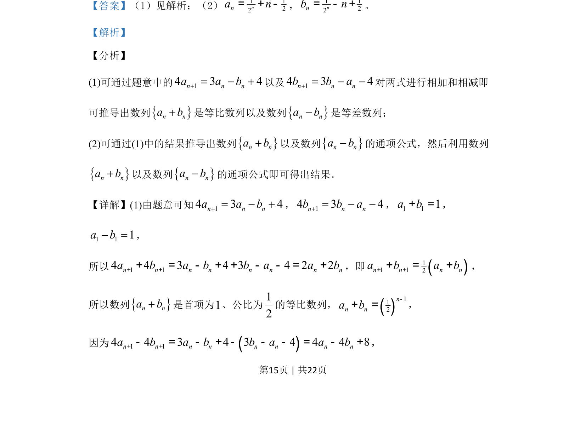

## 题面

## 摘要

已知数列{a_n}和{b_n}满足递推关系，证明{a_n+b_n}是等比数列、{a_n-b_n}是等差数列，并求通项公式。

## 关联考点

- [[381-数列概念-高中|数列]]
- [[358-等比数列概念|等比数列]]
- [[356-等差数列概念|等差数列]]
- [[383-数列递推公式|递推关系]]

## 答案与解析

> 📄 原 PDF 第 15 页：`素材/真题/吉林/2008-2024·（吉林）数学高考真题/2019年高考数学试卷（理）（新课标Ⅱ）（解析卷）.pdf`
