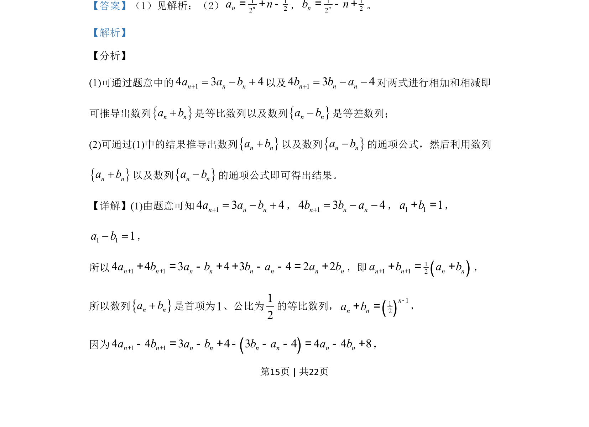

## 题面

## 摘要

已知数列{a_n}和{b_n}满足递推关系，证明{a_n+b_n}是等比数列、{a_n-b_n}是等差数列，并求通项公式。

## 关联考点

- [[381-数列概念-高中|数列]]
- [[358-等比数列概念|等比数列]]
- [[356-等差数列概念|等差数列]]
- [[383-数列递推公式|递推关系]]

## 答案与解析

> 📄 原 PDF 第 15 页：`素材/真题/吉林/2008-2024·（吉林）数学高考真题/2019年高考数学试卷（理）（新课标Ⅱ）（解析卷）.pdf`

<!-- 题干文本-start -->
## 题干文本
19.
已知数列{an}和{bn}满足a1=1，b1=0，14 3 4n n na a b=  ，14 3 4n n nb b a=.
（1）证明：{an+bn}是等比数列，{an–bn}是等差数列；
（2）求{an}和{bn}的通项公式.
<!-- 题干文本-end -->

<!-- 解析文本-start -->
## 解析文本
【答案】（1）见解析；（2）1 122nna n= + -，1 122nnb n= - +。
【解析】
【分析】
(1)可通过题意中的14 3 4n n na a b= 以及14 3 4n n nb b a=对两式进行相加和相减即
可推导出数列nnab是等比数列以及数列n na b是等差数列；
(2)可通过(1)中的结果推导出数列nnab以及数列n na b的通项公式，然后利用数列
nnab以及数列n na b的通项公式即可得出结果。
【详解】(1)由题意可知14 3 4n n na a b= ，14 3 4n n nb b a=，1 11a b+ =，
1 11a b =，
所以1 14 4 323 4 4 2n n n n n n n na b a b b a a b+ += + =- - +++ -，即()11 12n n n na b a b+ ++ +=，
所以数列nnab是首项为1、公比为12
的等比数列，()112nn na b-+ =，
因为 ()1 14 4 3 4 3 4 4 4 8n n n n n n n na b a b b a a b+ +- - -= + - = - +-，
<!-- 解析文本-end -->
