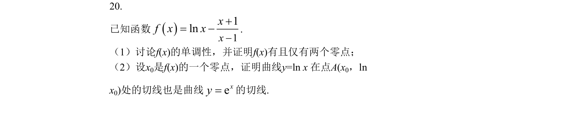
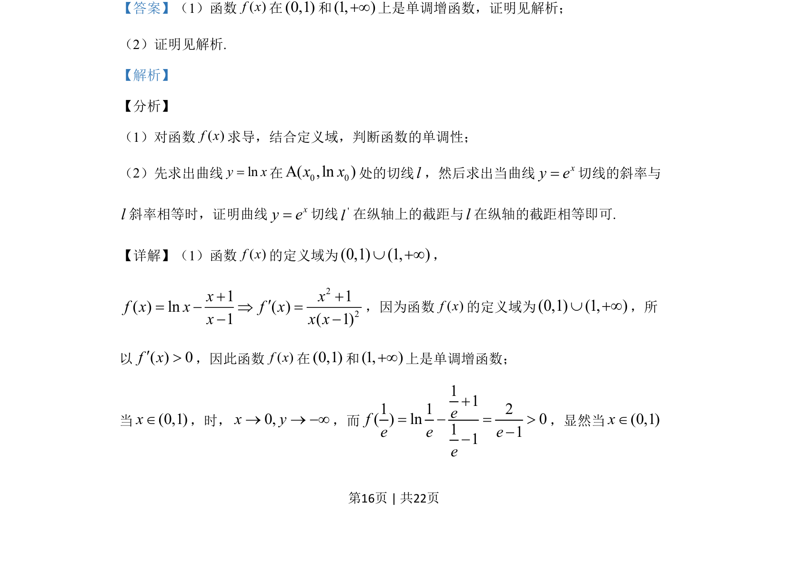

## 题面

## 摘要

已知f(x)=lnx-(x+1)/(x-1)，讨论单调性并证明有且仅有两个零点，再证明零点处lnx曲线切线也是e^x的切线。

## 关联考点

- [[425-反函数导数|导数]]
- [[432-导数与函数单调性|函数单调性]]
- [[288-函数零点|零点]]
- [[217-切线|切线]]

## 答案与解析

> 📄 原 PDF 第 16 页：`素材/真题/吉林/2008-2024·（吉林）数学高考真题/2019年高考数学试卷（理）（新课标Ⅱ）（解析卷）.pdf`
