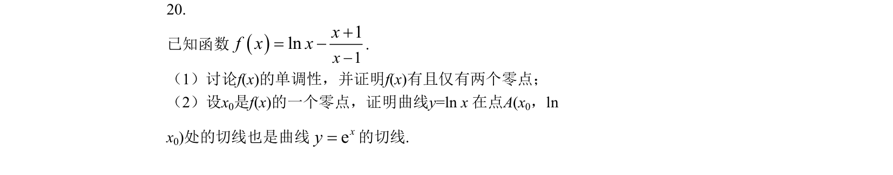
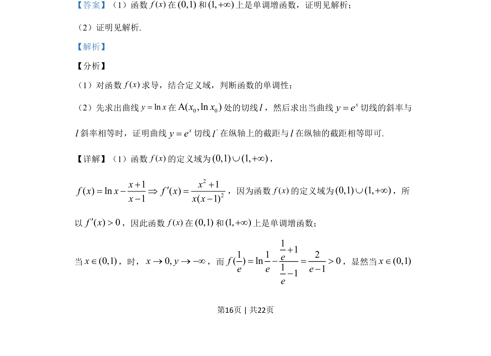

## 题面

## 摘要

已知f(x)=lnx-(x+1)/(x-1)，讨论单调性并证明有且仅有两个零点，再证明零点处lnx曲线切线也是e^x的切线。

## 关联考点

- [[425-反函数导数|导数]]
- [[432-导数与函数单调性|函数单调性]]
- [[288-函数零点|零点]]
- [[217-切线|切线]]

## 答案与解析

> 📄 原 PDF 第 16 页：`素材/真题/吉林/2008-2024·（吉林）数学高考真题/2019年高考数学试卷（理）（新课标Ⅱ）（解析卷）.pdf`

<!-- 题干文本-start -->
## 题干文本
20.
已知函数11lnxf x xx= .
（1）讨论f(x)的单调性，并证明f(x)有且仅有两个零点；
（2）设x0是f(x)的一个零点，证明曲线y=ln x 在点A(x0，ln 
x0)处的切线也是曲线exy=的切线.
<!-- 题干文本-end -->

<!-- 解析文本-start -->
## 解析文本
【答案】（1）函数( )f x在(0,1)和(1, )¥上是单调增函数，证明见解析；
（2）证明见解析.
【解析】
【分析】
（1）对函数( )f x求导，结合定义域，判断函数的单调性；
（2）先求出曲线lny x=在0 0A( ,ln )x x处的切线l，然后求出当曲线xy e=切线的斜率与
l斜率相等时，证明曲线xy e=切线'l在纵轴上的截距与l在纵轴的截距相等即可.
【详解】（1）函数( )f x的定义域为(0,1) (1, )È ¥，
221 1( ) ln ( )1 ( 1)x xf x x f xx x x ¢=  Þ = 
，因为函数( )f x的定义域为(0,1) (1, )È ¥，所
以( ) 0f x¢>，因此函数( )f x在(0,1)和(1, )¥上是单调增函数；
当(0,1)xÎ，时，0,x y® ® ¥，而
111 1 2( ) ln 0111efe e ee=  = >
，显然当(0,1)xÎ
的
<!-- 解析文本-end -->
