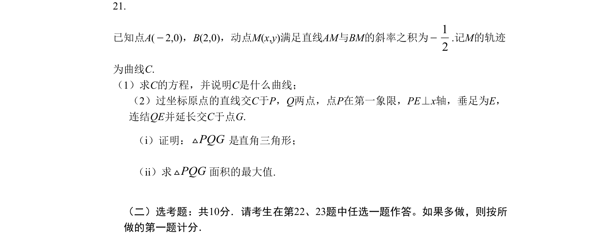
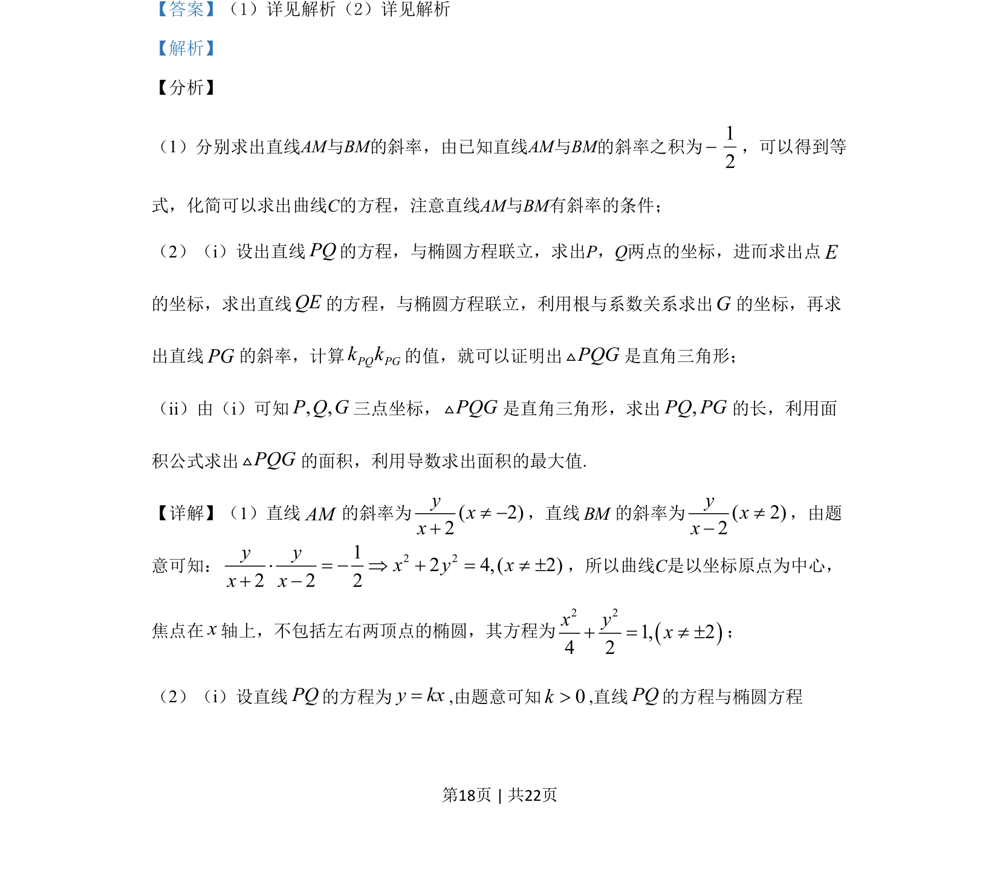

## 题面

## 摘要

动点M满足直线AM与BM斜率之积为-1/2，求轨迹C方程（椭圆），并研究过原点直线交C于P、Q两点时△PQG的直角性与面积最大值。

## 关联考点

- [[1112-解析几何|解析几何]]
- [[389-椭圆定义与方程|椭圆]]
- [[376-圆锥曲线轨迹问题|轨迹方程]]
- [[620-三角形面积最值|三角形面积最值]]

## 答案与解析

> 📄 原 PDF 第 18 页：`素材/真题/吉林/2008-2024·（吉林）数学高考真题/2019年高考数学试卷（理）（新课标Ⅱ）（解析卷）.pdf`
