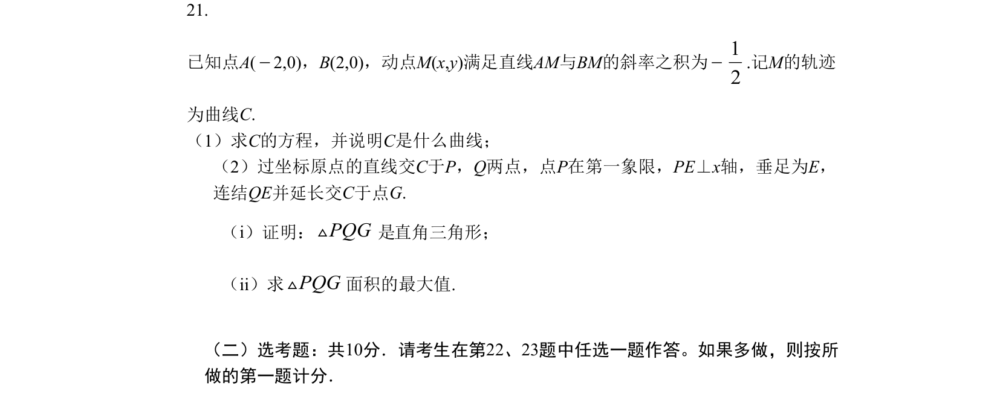
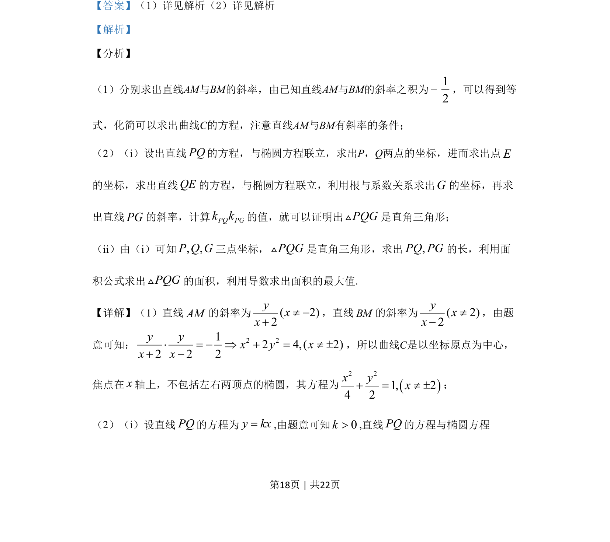

## 题面

## 摘要

动点M满足直线AM与BM斜率之积为-1/2，求轨迹C方程（椭圆），并研究过原点直线交C于P、Q两点时△PQG的直角性与面积最大值。

## 关联考点

- [[1111-解析几何|解析几何]]
- [[389-椭圆定义与方程|椭圆]]
- [[376-圆锥曲线轨迹问题|轨迹方程]]
- [[620-三角形面积最值|三角形面积最值]]

## 答案与解析

> 📄 原 PDF 第 18 页：`素材/真题/吉林/2008-2024·（吉林）数学高考真题/2019年高考数学试卷（理）（新课标Ⅱ）（解析卷）.pdf`

<!-- 题干文本-start -->
## 题干文本
21.
已知点A(−2,0)，B(2,0)，动点M(x,y)满足直线AM与BM的斜率之积为−
12
.记M的轨迹
为曲线C.
（1）求C的方程，并说明C是什么曲线；
（2）过坐标原点的直线交C于P，Q两点，点P在第一象限，PE⊥x轴，垂足为E，
连结QE并延长交C于点G.
（i）证明：PQGV直角三角形；
（ii）求PQGV面积的最大值.
（二）选考题：共10分．请考生在第22、23题中任选一题作答。如果多做，则按所
做的第一题计分．
<!-- 题干文本-end -->

<!-- 解析文本-start -->
## 解析文本
【答案】（1）详见解析（2）详见解析
【解析】
【分析】
（1）分别求出直线AM与BM的斜率，由已知直线AM与BM的斜率之积为−
12
，可以得到等
式，化简可以求出曲线C的方程，注意直线AM与BM有斜率的条件；
（2）（i）设出直线PQ的方程，与椭圆方程联立，求出P，Q两点的坐标，进而求出点E
的坐标，求出直线QE的方程，与椭圆方程联立，利用根与系数关系求出G的坐标，再求
出直线PG的斜率，计算PQ PGk k的值，就可以证明出PQGV是直角三角形；
（ii）由（i）可知,,PQG三点坐标，PQGV是直角三角形，求出,PQ PG的长，利用面
积公式求出PQGV的面积，利用导数求出面积的最大值.
【详解】（1）直线AM的斜率为( 2)2yxx¹ 
，直线BM的斜率为( 2)2yxx¹
，由题
意可知： 2 212 4,( 2)2 2 2y yx y xx x× =  Þ  = ¹ ± 
，所以曲线C是以坐标原点为中心，
焦点在x轴上，不包括左右两顶点的椭圆，其方程为2 21, 24 2x yx = ¹ ±；
（2）（i）设直线PQ的方程为y kx=,由题意可知0k>,直线PQ的方程与椭圆方程
是
<!-- 解析文本-end -->
