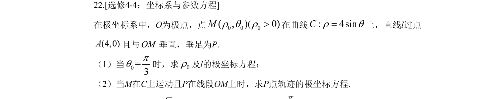
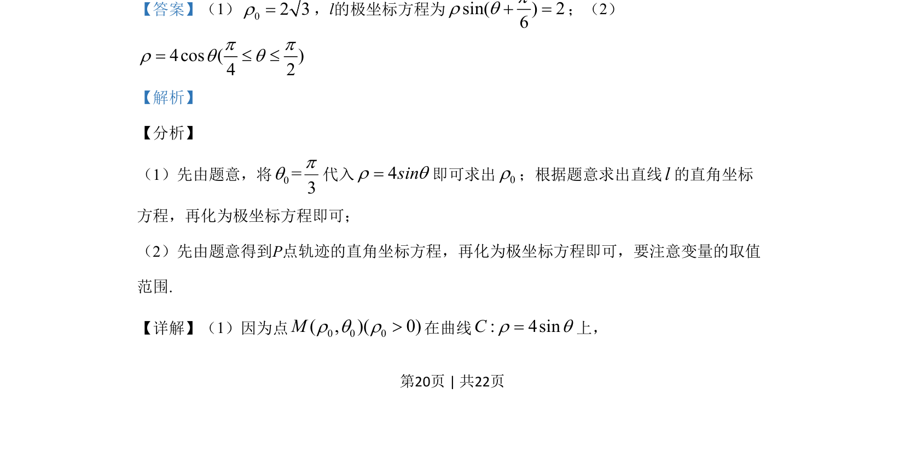

## 题面

## 摘要

极坐标系中，点M在曲线ρ=4sinθ上，直线l过A(4,0)且与OM垂直，求垂足P的极坐标方程及轨迹。

## 关联考点

- [[919-极坐标|极坐标]]
- [[061-方程|参数方程]]
- [[376-圆锥曲线轨迹问题|轨迹方程]]

## 答案与解析

> 📄 原 PDF 第 20 页：`素材/真题/吉林/2008-2024·（吉林）数学高考真题/2019年高考数学试卷（理）（新课标Ⅱ）（解析卷）.pdf`
