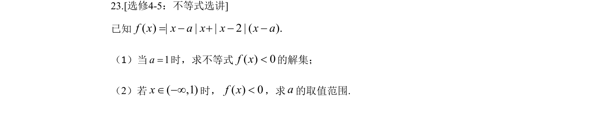
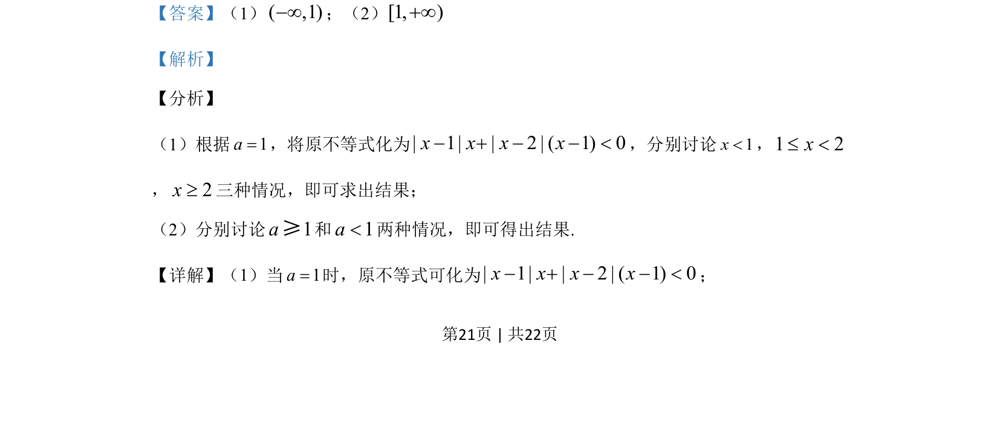

## 题面

## 摘要

该题考查使用排除法与排列组合求解有限制条件的名次排列问题。

## 关联考点

- [[031-搭配|排列组合]]
- [[037-推理|逻辑推理]]
- [[032-除法|排除法]]

## 答案与解析

> 📄 原 PDF 第 21 页：`素材/真题/吉林/2008-2024·（吉林）数学高考真题/2019年高考数学试卷（理）（新课标Ⅱ）（解析卷）.pdf`
