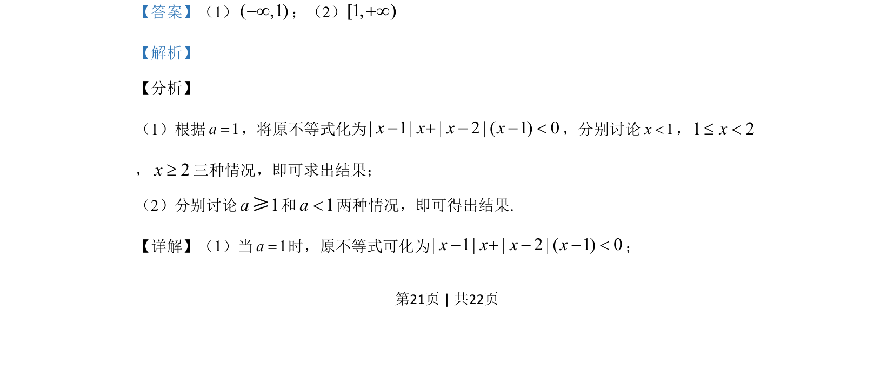

## 题面

## 摘要

已知f(x)=|x-a|x+|x-2|(x-a)（选修4-5），分当a=1时求f(x)<0解集，及x∈(-∞,1)时f(x)<0恒成立求a范围。

## 关联考点

- [[1092-绝对值不等式|绝对值不等式]]
- [[424-参数分类讨论|分类讨论]]
- [[721-参数取值范围|参数取值范围]]

## 答案与解析

> 📄 原 PDF 第 21 页：`素材/真题/吉林/2008-2024·（吉林）数学高考真题/2019年高考数学试卷（理）（新课标Ⅱ）（解析卷）.pdf`

<!-- 题干文本-start -->
## 题干文本
23.[选修4-5：不等式选讲] 
已知( ) | | | 2 | ( ).f x x a x x x a= − + − − 
（1）当1a=时，求不等式( ) 0f x<的解集；
（2）若( ,1)xÎ −¥时，( ) 0f x<，求a的取值范围.
<!-- 题干文本-end -->

<!-- 解析文本-start -->
## 解析文本
【答案】（1）( ,1)−¥；（2）[1, )+¥
【解析】
【分析】
（1）根据1a=，将原不等式化为| 1| | 2 | ( 1) 0x x x x− + − − <，分别讨论1x<，1 2x£ <
，2x³三种情况，即可求出结果；
（2）分别讨论1a≥和1a<两种情况，即可得出结果.
【详解】（1）当1a=时，原不等式可化为| 1| | 2 | ( 1) 0x x x x− + − − <；
<!-- 解析文本-end -->
