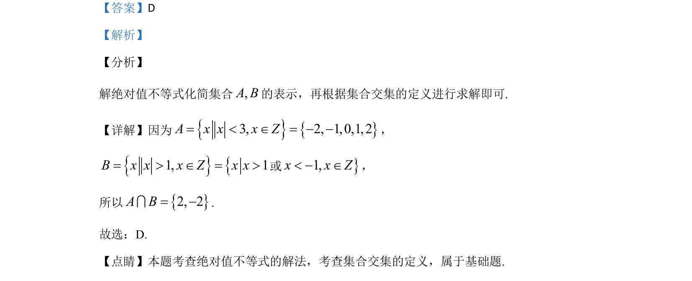

## 题面

## 摘要

解绝对值不等式化简集合A和B，再根据交集定义求解。

## 关联考点

- [[1092-绝对值不等式|绝对值不等式]]
- [[1139-集合的交集|集合交集]]

## 答案与解析

> 📄 原 PDF 第 1 页：`素材/真题/吉林/2008-2024·（吉林）数学高考真题/2020年高考数学试卷（文）（新课标Ⅱ）（解析卷）.pdf`

<!-- 题干文本-start -->
## 题干文本
1.已知集合A={x||x|<3，x∈Z}，B={x||x|>1，x∈Z}，则A∩B=（    ）
A. ÆB. {–3，–2，2，3）
C. {–2，0，2} D. {–2，2}
<!-- 题干文本-end -->

<!-- 解析文本-start -->
## 解析文本
【答案】D
【解析】
【分析】
解绝对值不等式化简集合,A B的表示，再根据集合交集的定义进行求解即可.
【详解】因为3, 2, 1,0,1, 2A x x x Z= < Î = - -，
1, 1B x x x Z x x= > Î = >或1,x x Z< - Î，
所以2, 2A B= -I.
故选：D.
【点睛】本题考查绝对值不等式的解法，考查集合交集的定义，属于基础题.
<!-- 解析文本-end -->
