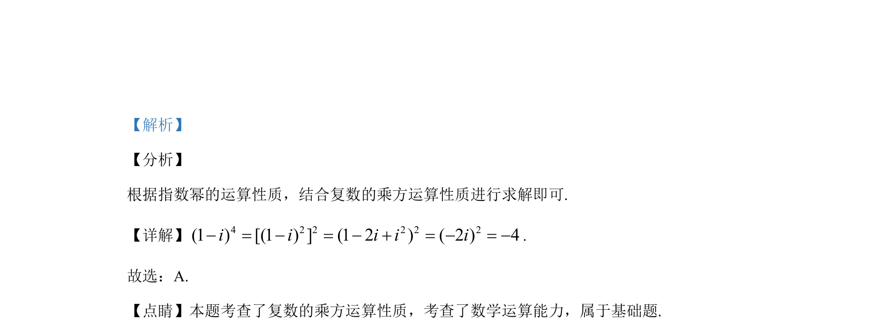

## 题面

## 摘要

本题考查复数的乘方运算，结合指数幂的运算性质求值。

## 关联考点

- [[800-复数乘方|复数乘方]]
- [[884-指数幂运算|指数幂运算]]
- [[896-数学运算|数学运算]]

## 答案与解析

> 📄 原 PDF 第 1 页：`素材/真题/吉林/2008-2024·（吉林）数学高考真题/2020年高考数学试卷（文）（新课标Ⅱ）（解析卷）.pdf`
