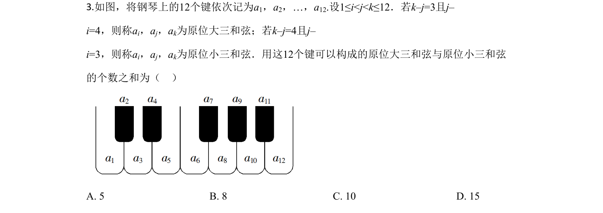
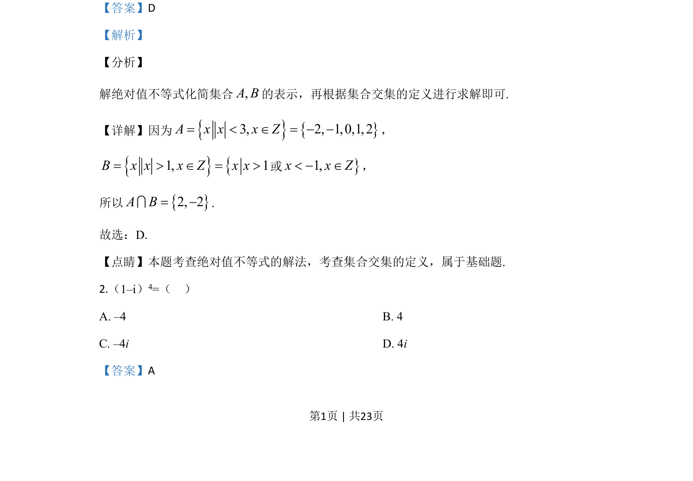
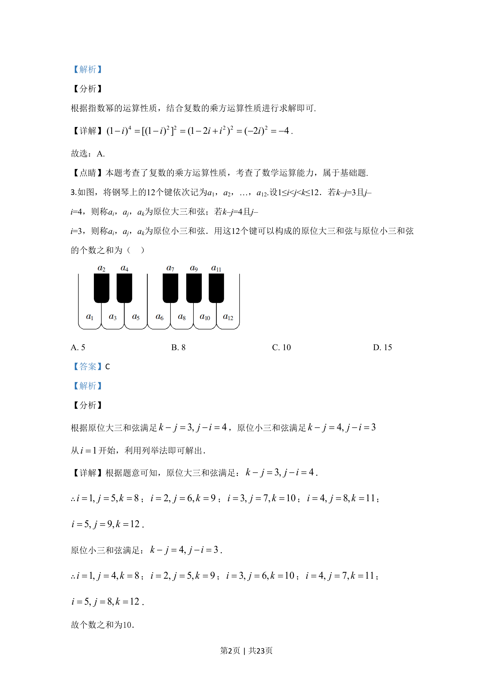

## 题面

## 摘要

钢琴12键按定义的原位大三和弦(k-j=3,j-i=4)与原位小三和弦(k-j=4,j-i=3)计数, 求两类和弦个数之和。

## 关联考点

- [[1112-计数原理|计数原理]]
- [[703-列举法|列举法]]
- [[1090-组合计数|组合计数]]

## 答案与解析

> 📄 原 PDF 第 2 页：`素材/真题/吉林/2008-2024·（吉林）数学高考真题/2020年高考数学试卷（文）（新课标Ⅱ）（解析卷）.pdf`
