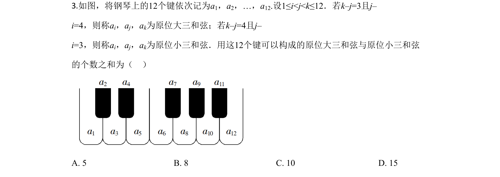
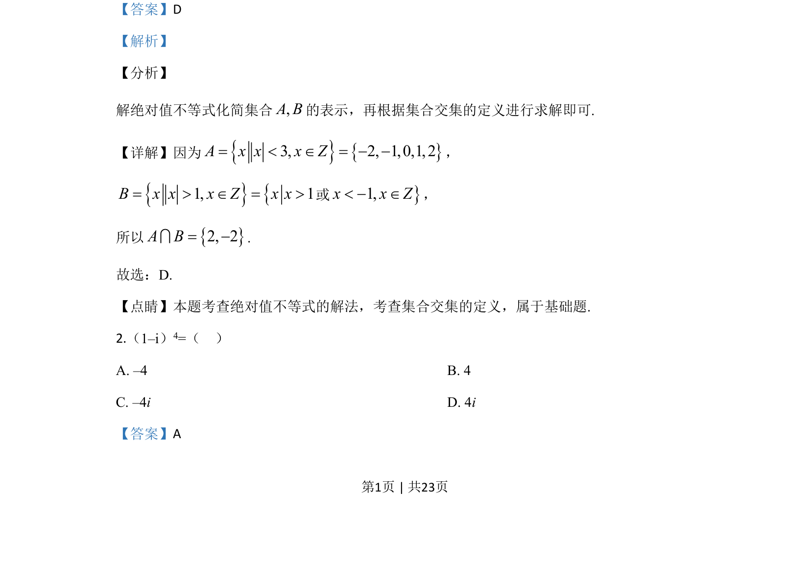
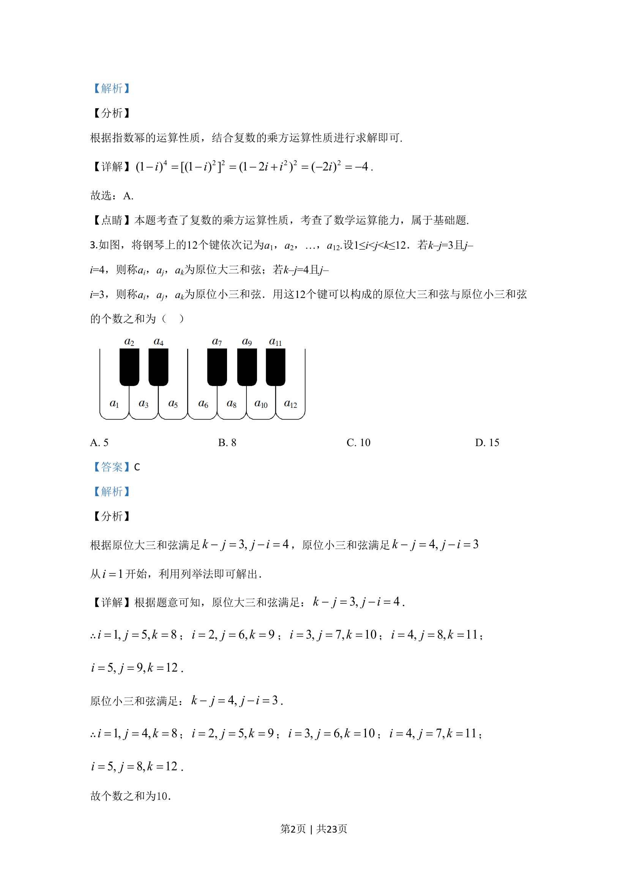

## 题面

## 摘要

钢琴12键按定义的原位大三和弦(k-j=3,j-i=4)与原位小三和弦(k-j=4,j-i=3)计数, 求两类和弦个数之和。

## 关联考点

- [[1112-计数原理|计数原理]]
- [[703-列举法|列举法]]
- [[1090-组合计数|组合计数]]

## 答案与解析

> 📄 原 PDF 第 2 页：`素材/真题/吉林/2008-2024·（吉林）数学高考真题/2020年高考数学试卷（文）（新课标Ⅱ）（解析卷）.pdf`

<!-- 题干文本-start -->
## 题干文本
3.如图，将钢琴上的12个键依次记为a1，a2，…，a12.设1≤i<j<k≤12．若k–j=3且j–
i=4，则称ai，aj，ak为原位大三和弦；若k–j=4且j–
i=3，则称ai，aj，ak为原位小三和弦．用这12个键可以构成的原位大三和弦与原位小三和弦
的个数之和为（    ）
A. 5 B. 8 C. 10 D. 15
<!-- 题干文本-end -->

<!-- 解析文本-start -->
## 解析文本
【答案】C
【解析】
【分析】
根据原位大三和弦满足3, 4k j j i- = - =，原位小三和弦满足4, 3k j j i- = - =
从1i=开始，利用列举法即可解出．
【详解】根据题意可知，原位大三和弦满足：3, 4k j j i- = - =．
∴1, 5, 8i j k= = =；2, 6, 9i j k= = =；3, 7, 10i j k= = =；4, 8, 11i j k= = =；
5, 9, 12i j k= = =．
原位小三和弦满足：4, 3k j j i- = - =．
∴1, 4, 8i j k= = =；2, 5, 9i j k= = =；3, 6, 10i j k= = =；4, 7, 11i j k= = =；
5, 8, 12i j k= = =．
故个数之和为10．
<!-- 解析文本-end -->
