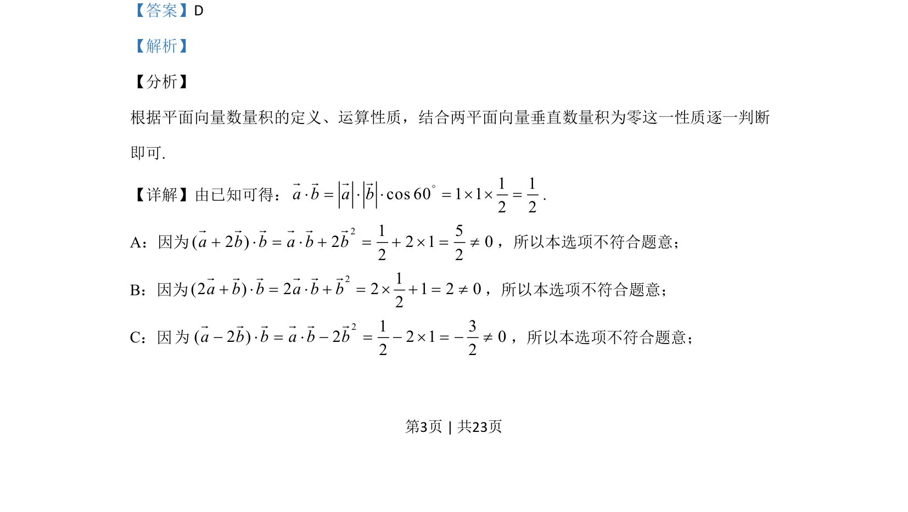
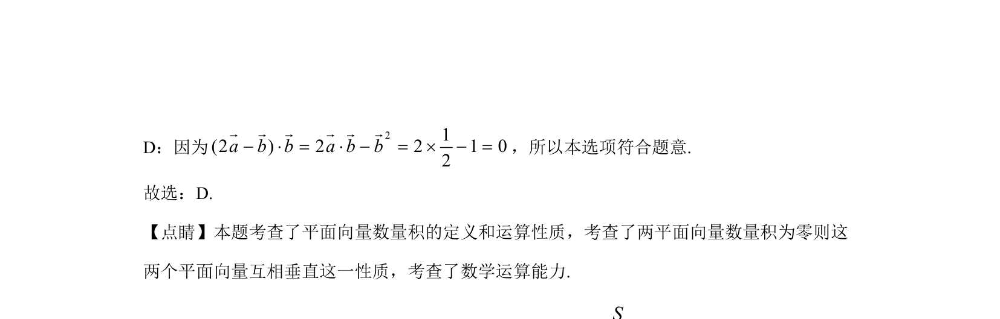

## 题面

## 摘要

本题通过计算平面向量的数量积，判断两向量是否垂直。

## 关联考点

- [[858-平面向量的数量积|平面向量的数量积]]
- [[746-向量垂直充要条件|向量垂直的充要条件]]
- [[896-数学运算|数学运算]]

## 答案与解析

> 📄 原 PDF 第 3 页：`素材/真题/吉林/2008-2024·（吉林）数学高考真题/2020年高考数学试卷（文）（新课标Ⅱ）（解析卷）.pdf`

<!-- 题干文本-start -->
## 题干文本
5.已知单位向量a，b的夹角为60°，则在下列向量中，与b垂直的是（    ）
A. a+2bB. 2a+bC. a–2bD. 2a–b
<!-- 题干文本-end -->

<!-- 解析文本-start -->
## 解析文本
【答案】D
【解析】
【分析】
根据平面向量数量积的定义、运算性质，结合两平面向量垂直数量积为零这一性质逐一判断
即可.
【详解】由已知可得： 1 1cos 60 1 12 2a b a b°× = × × = ´ ´ =r r r r
.
A：因为
21 5( 2 ) 2 2 1 02 2a b b a b b+ × = × + = + ´ = ¹r r r r r r
，所以本选项不符合题意；
B：因为
21(2 ) 2 2 1 2 02a b b a b b+ × = × + = ´ + = ¹r r r r r r
，所以本选项不符合题意；
C：因
21 3( 2 ) 2 2 1 02 2a b b a b b- × = × - = - ´ = - ¹r r r r r r
，所以本选项不符合题意；
的
为
<!-- 解析文本-end -->
