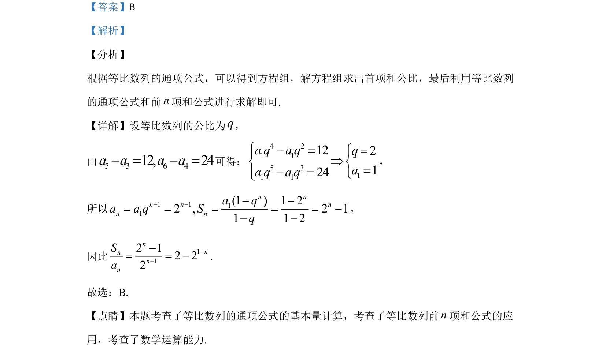

## 题面

## 摘要

该题考查等比数列中已知两项差求首项和公比，并计算通项与前n项和的关系式。

## 关联考点

- [[358-等比数列概念|等比数列]]
- [[384-数列通项公式|通项公式]]
- [[713-前n项和公式|前n项和公式]]
- [[794-基本量计算|基本量计算]]

## 答案与解析

> 📄 原 PDF 第 4 页：`素材/真题/吉林/2008-2024·（吉林）数学高考真题/2020年高考数学试卷（文）（新课标Ⅱ）（解析卷）.pdf`
