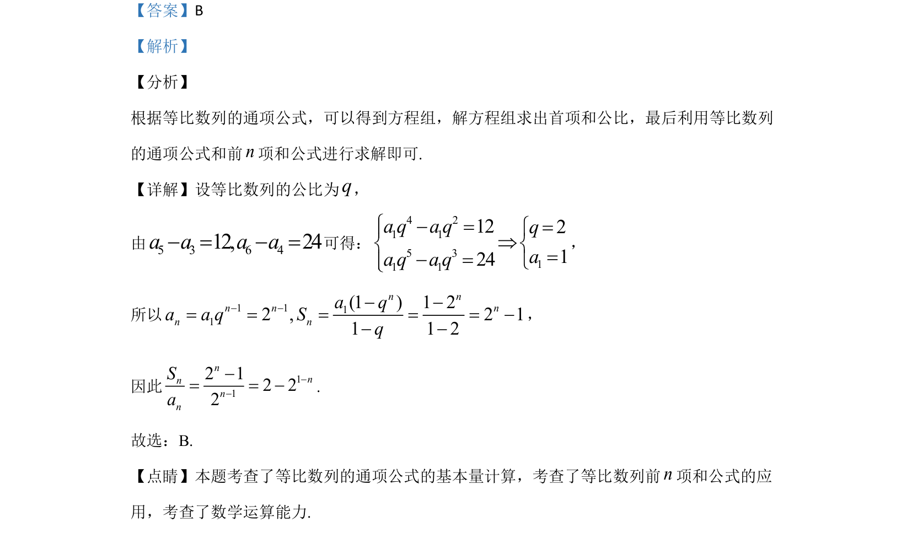

## 题面

## 摘要

该题考查等比数列中已知两项差求首项和公比，并计算通项与前n项和的关系式。

## 关联考点

- [[358-等比数列概念|等比数列]]
- [[384-数列通项公式|通项公式]]
- [[713-前n项和公式|前n项和公式]]
- [[794-基本量计算|基本量计算]]

## 答案与解析

> 📄 原 PDF 第 4 页：`素材/真题/吉林/2008-2024·（吉林）数学高考真题/2020年高考数学试卷（文）（新课标Ⅱ）（解析卷）.pdf`

<!-- 题干文本-start -->
## 题干文本
6.记Sn为等比数列{an}的前n项和．若a5–a3=12，a6–a4=24，则nnSa=（    ）
A. 2n–1 B. 2–2 1–n C. 2–2n–1 D. 21–n–1
<!-- 题干文本-end -->

<!-- 解析文本-start -->
## 解析文本
【答案】B
【解析】
【分析】
根据等比数列的通项公式，可以得到方程组，解方程组求出首项和公比，最后利用等比数列
的通项公式和前n项和公式进行求解即可.
【详解】设等比数列的公比为q，
由5 3 6 412, 24a a a a- = - =可得：
4 21 15 311 1122124a q a qqaa q a qì- ==ìïÞí í=- =ïîî
，
所以 1 111(1 )1 22 , 2 11 1 2nnn n nn na qa a q Sq- ---= = = = = -- -
，
因此 112 12 22nnnnnSa---= = -.
故选：B.
【点睛】本题考查了等比数列的通项公式的基本量计算，考查了等比数列前n项和公式的应
用，考查了数学运算能力.
<!-- 解析文本-end -->
