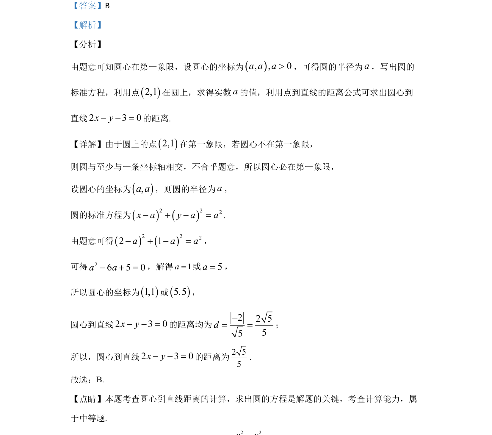

## 题面

## 摘要

考查根据象限条件设圆心坐标求圆方程，进而计算点到直线距离

## 关联考点

- [[373-圆的标准方程|圆的标准方程]]
- [[392-点到直线距离公式|点到直线距离公式]]
- [[1108-解一元二次方程|解一元二次方程]]

## 答案与解析

> 📄 原 PDF 第 6 页：`素材/真题/吉林/2008-2024·（吉林）数学高考真题/2020年高考数学试卷（文）（新课标Ⅱ）（解析卷）.pdf`
