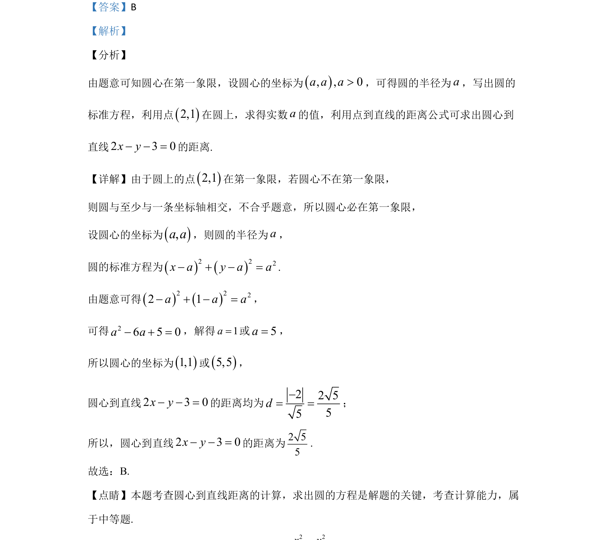

## 题面

## 摘要

考查根据象限条件设圆心坐标求圆方程，进而计算点到直线距离

## 关联考点

- [[373-圆的标准方程|圆的标准方程]]
- [[570-点到直线的距离公式|点到直线距离公式]]
- [[1107-解一元二次方程|解一元二次方程]]

## 答案与解析

> 📄 原 PDF 第 6 页：`素材/真题/吉林/2008-2024·（吉林）数学高考真题/2020年高考数学试卷（文）（新课标Ⅱ）（解析卷）.pdf`

<!-- 题干文本-start -->
## 题干文本
8.若过点（2，1）的圆与两坐标轴都相切，则圆心到直线2 3 0x y- - =的距离为（    ）
A. 55
B. 2 55
C. 3 55
D. 4 55
<!-- 题干文本-end -->

<!-- 解析文本-start -->
## 解析文本
【答案】B
【解析】
【分析】
由题意可知圆心在第一象限，设圆心的坐标为(), , 0a a a>，可得圆的半径为a，写出圆的
标准方程，利用点()2,1在圆上，求得实数a的值，利用点到直线的距离公式可求出圆心到
直线2 3 0x y- - =的距离.
【详解】由于圆上的点()2,1在第一象限，若圆心不在第一象限，
则圆与至少与一条坐标轴相交，不合乎题意，所以圆心必在第一象限，
设圆心的坐标为(),a a，则圆的半径为a，
圆的标准方程为()()2 22x a y a a- + - =.
由题意可得()()2 222 1a a a- + - =，
可得26 5 0a a- + =，解得1a=或5a=，
所以圆心的坐标为()1,1或()5,5，
圆心到直线2 3 0x y- - =的距离均为
22 555d-= =；
所以，圆心到直线2 3 0x y- - =的距离为2 55
.
故选：B.
【点睛】本题考查圆心到直线距离的计算，求出圆的方程是解题的关键，考查计算能力，属
于中等题.
<!-- 解析文本-end -->
