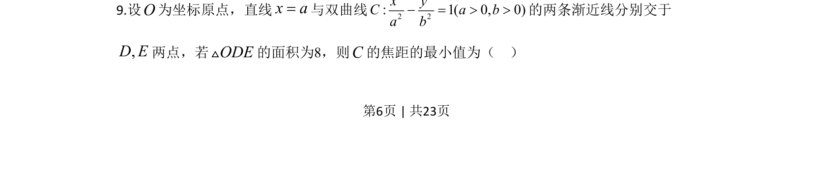
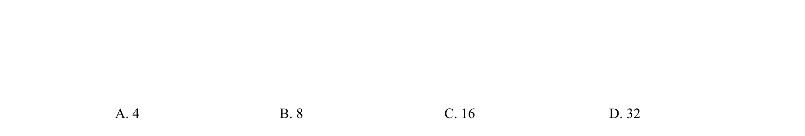
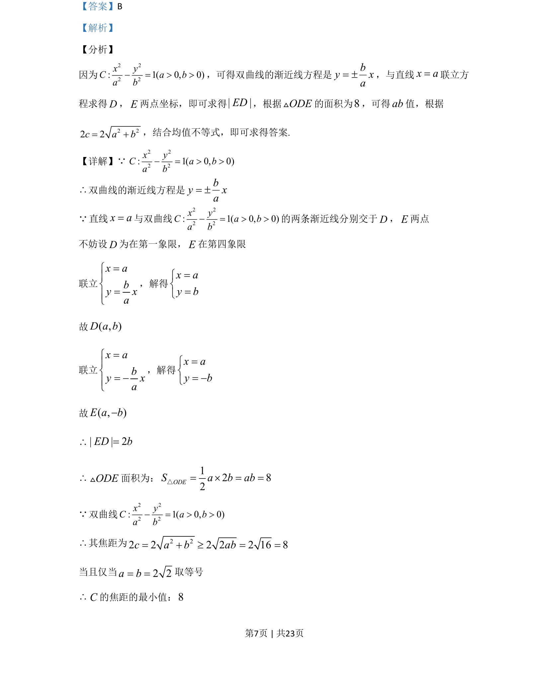
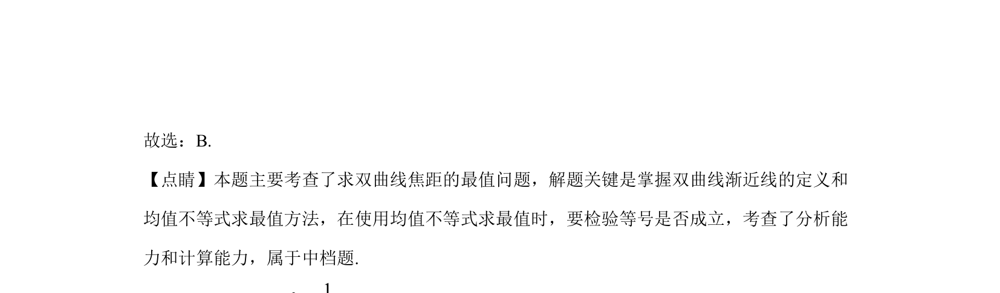

## 题面

## 摘要

本题通过双曲线渐近线与直线交点求三角形面积，结合焦距与均值不等式求最值。

## 关联考点

- [[734-双曲线的渐近线|双曲线的渐近线]]
- [[1211-点到直线距离|点到直线距离]]
- [[295-基本不等式|均值不等式]]
- [[062-多边形面积|三角形面积]]

## 答案与解析

> 📄 原 PDF 第 6 页：`素材/真题/吉林/2008-2024·（吉林）数学高考真题/2020年高考数学试卷（文）（新课标Ⅱ）（解析卷）.pdf`
