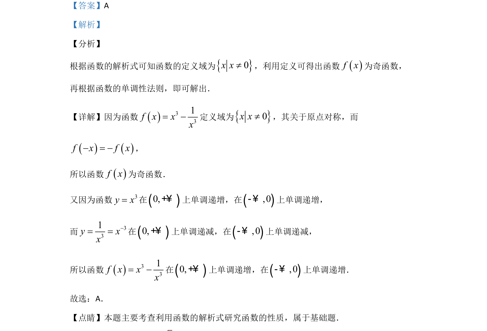

## 题面

## 摘要

考查由解析式求函数定义域、判断奇偶性和单调性

## 关联考点

- [[690-函数的定义域|函数的定义域]]
- [[284-函数的奇偶性|函数的奇偶性]]
- [[282-函数的单调性|函数的单调性]]

## 答案与解析

> 📄 原 PDF 第 8 页：`素材/真题/吉林/2008-2024·（吉林）数学高考真题/2020年高考数学试卷（文）（新课标Ⅱ）（解析卷）.pdf`
