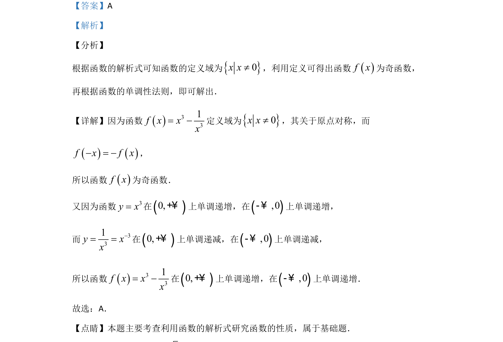

## 题面

## 摘要

考查由解析式求函数定义域、判断奇偶性和单调性

## 关联考点

- [[680-函数定义域|函数的定义域]]
- [[284-函数的奇偶性|函数的奇偶性]]
- [[282-函数的单调性|函数的单调性]]

## 答案与解析

> 📄 原 PDF 第 8 页：`素材/真题/吉林/2008-2024·（吉林）数学高考真题/2020年高考数学试卷（文）（新课标Ⅱ）（解析卷）.pdf`

<!-- 题干文本-start -->
## 题干文本
10.设函数 331( )f x xx= -,则( )f x（    ）
A. 是奇函数，且在(0,+∞)单调递增 B. 是奇函数，且在(0,+∞)单调递减
C. 是偶函数，且在(0,+∞)单调递增 D. 是偶函数，且在(0,+∞)单调递减
<!-- 题干文本-end -->

<!-- 解析文本-start -->
## 解析文本
【答案】A
【解析】
【分析】
根据函数的解析式可知函数的定义域为{}0x x¹，利用定义可得出函数()f x为奇函数，
再根据函数的单调性法则，即可解出．
【详解】因为函数()331f x xx= -定义域为{}0x x¹，其关于原点对称，而
()()f x f x- = -，
所以函数()f x为奇函数．
又因为函数3y x=在()0,+¥上单调递增，在(),0- ¥上单调递增，
而 331y xx-= =在()0,+¥上单调递减，在(),0- ¥上单调递减，
所以函数()331f x xx= -在()0,+¥上单调递增，在(),0- ¥上单调递增．
故选：A．
【点睛】本题主要考查利用函数的解析式研究函数的性质，属于基础题．
<!-- 解析文本-end -->
