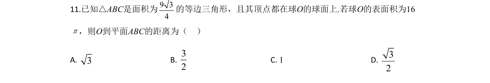
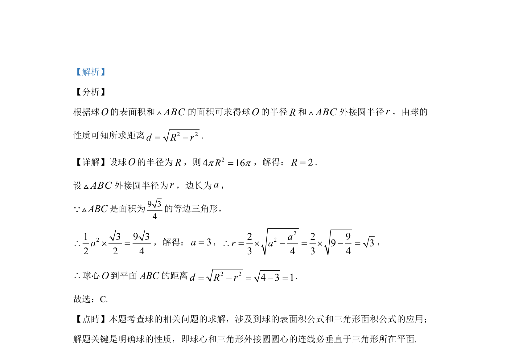

## 题面

## 摘要

利用球表面积公式和等边三角形面积公式，结合球心到截面距离公式求解空间距离。

## 关联考点

- [[球的表面积]]
- [[等边三角形面积]]
- [[球的性质]]
- [[354-空间距离|空间距离]]

## 答案与解析

> 📄 原 PDF 第 8 页：`素材/真题/吉林/2008-2024·（吉林）数学高考真题/2020年高考数学试卷（文）（新课标Ⅱ）（解析卷）.pdf`
